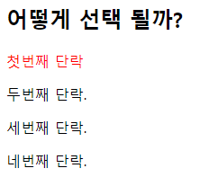
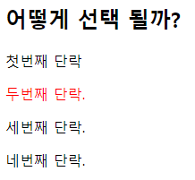

# Workshop01

> for understand HTML tag & CSS Selector


### 1. img tag

my_photo.png를 보여주는  tag를 작성하시오.
단, 이미지가 제대로 출력되지 않을 때는 ssafy 문자열이 출력 되도록 작성하시오

답)

```html

```


### 2. 파일 경로
위와 같이 경로를 __(a)__로 작성 할 시, github에 업로드 하거나 전체 폴더의 위치가
변경 되었을 때 이미지를 불러 올 수 없게 된다. 이를 해결 하려면 이미지 경로를 __(b)__
로 바꾸어 작성하면 된다. __(a)__와 __(b)__에 들어갈 말과 __(b)__ 로 변경한 코드를 작성하시오.

답)

(a) : 절대경로 

(b) : 상대경로 / 이미지를 삽입할 HTML 문서를 기준으로 경로를 인식

```html

```


### 3. Hyper Link

출력된 my_photo.png 이미지를 클릭하면 ssafy.com으로 이동하도록 하시오.

```html
<a href="https://www.ssafy.com">
      
    </a>
```


### 4. 선택자

1) 

```html
<!DOCTYPE html>

<head>
  <style>
    #ssafy > p:nth-of-child(2) {
      color: red;
    }
  </style>
</head>

<body>
  <div id = "ssafy">
    <h2>어떻게 선택 될까?</h2>
    <p>첫번째 단락</p>
    <p>두번째 단락.</p>
    <p>세번째 단락.</p>
    <p>네번째 단락.</p>
  </div>
</body>

</html>
```

결과.



2) `nth-child`를 `nth-of-type`으로 변경한 결과



3) 

```html
 <div id = "ssafy">            
    <h2>어떻게 선택 될까?</h2>		# 1
    <p>첫번째 단락</p>			 # 2	#1
    <p>두번째 단락.</p>					#2
    <p>세번째 단락.</p>				
    <p>네번째 단락.</p>
  </div>
```

 `p:nth-child(2)`: 2번째 자식이p라면 적용

`p:nth-of-type(2)`는  (p) 엘리먼트중 2번째에 적용 - 두번 째 p에 적용