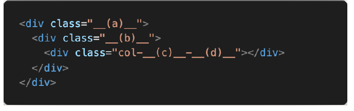

# 4. Homework04

>  CSS Felxible Box Layout & Bootstrap Grid System

### 1. CSS flex-direction

 Flex box의 주축을 변경하는 flex-direction의 4가지 값과 각각의 특징을 작성하시오.

​	**답)**  row - 왼쪽에서 오른쪽으로 / row-reverse : 오른쪽에서 왼쪽으로 

​		column- 위에서 아래로  / column : 아래에서 위로

### 2. flex-direction

flex-direction 4가지 요소와 대응하는 bootstrap 클래스를 작성하시오.

**답)**  주축 : justify-content(메인축 기준 여러 줄 정렬)

 교차축: align-content(여러 줄 정렬) /  align-items(한 줄 정렬) / align-self (선택한 요소 하나 정렬)

### 3.align-items

align-items 속성의 4가지 값과 각각의 특징을 작성하시오.

**답)**

1) flex-start : 교차죽 기준 시작점으로 부터 정렬

2) flex-end :  교차죽 기준 끝점으로 부터 정렬

3) center: 교차죽 기준 중앙에 정렬

4) stretch: 교차죽 길이만큼 알아서 정렬

### 4. flex-flow
flex-flow 속성은 두가지 속성의 축약형이다. 올바르게 짝지어진 것을 고르시오.
(1) flex-direction, flex-wrap  ○
(2) flex-direction, align-items
(3) justify-content, flex-wrap
(4) justify-content, align-items

### 5. Bootstrap Grid System
하단 코드에 Bootstrap Grid System을 적용시키고자 할 때, __(a)__, __(b)__ 각각에 입력해야 할 클래스 이름을 작성하시오.

 **답)** : (a) : container / (b): row 

### 6. Breakpoint prefix

Bootstrap Grid System에서 요소의 크기를 지정하기 위해서는 상단 코드와 같은 형태로
클래스 이름을 지정해야 한다.

1) __(c)__에 들어갈 수 있는 값과 그 값들이 가지는 의미를 작성하시오. _breakpoints 

  **답)** (c)   sm:  576px이상  / md:  768px이상 / lg:  992px이상  / xl :  1200px이상/ xxl : 1400px이상

2) __(d)__에 들어갈 수 있는 값과 그 값들이 가지는 의미를 작성하시오.

**답)** 안들어갈수도 있고, 1~12 / 안들어가면 auto로 자리 차지.