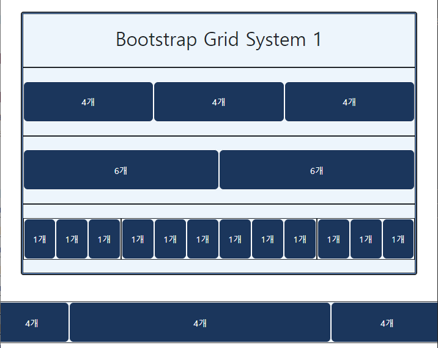
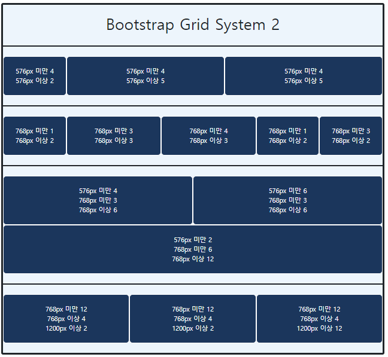
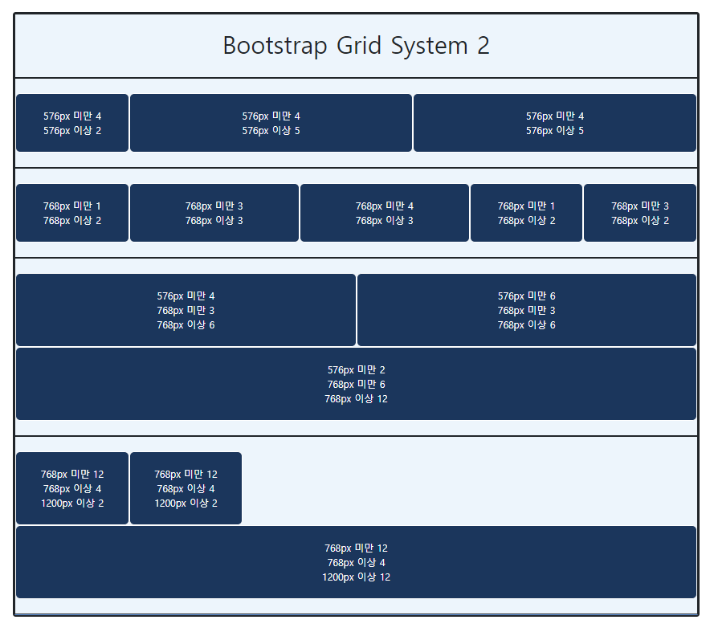
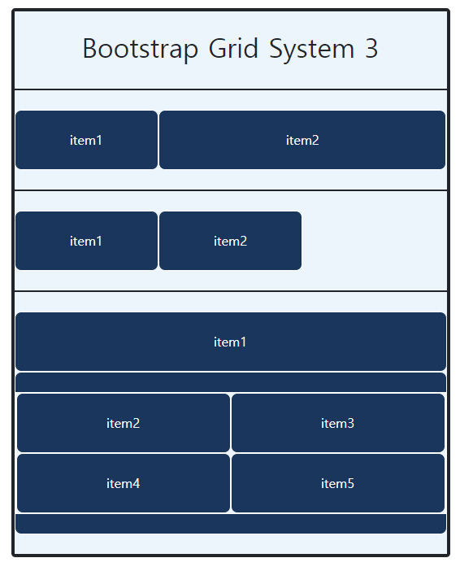
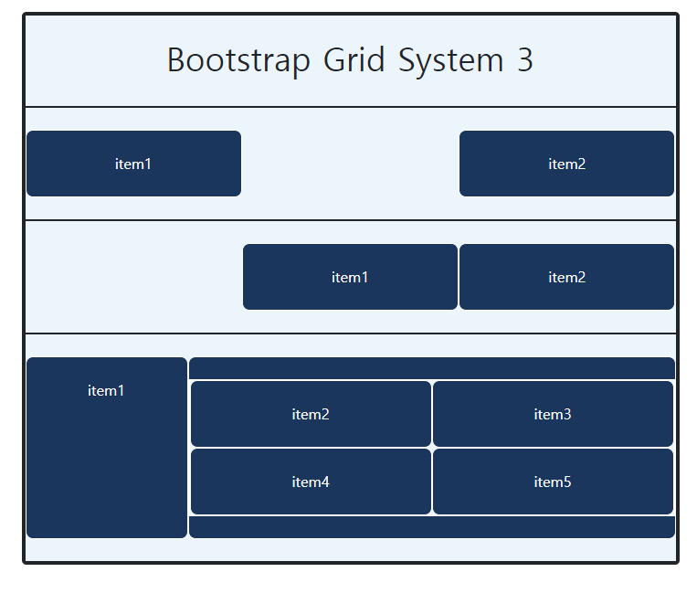
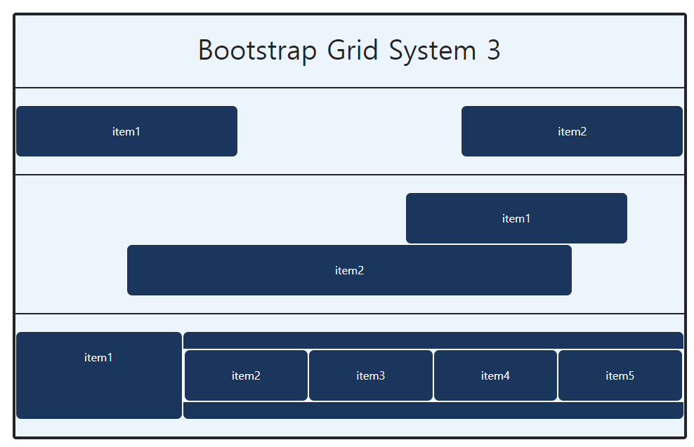

# Workshop04

> Boorstrap Grid System

### 1.



### 2. 

```html
/*3번과 4번 코드 일부*/
<div class="row">
      <div class="item col-sm-1 col-md-2"> <p>768px 미만 1 <br> 768px 이상 2</p> </div>
      <div class="item col-sm-3 col-md-3"> <p>768px 미만 3 <br> 768px 이상 3</p> </div>
	  <div class="item col-sm-12 col-md-4 col-xl-2">
      <p>768px 미만 12 <br> 768px 이상 4 <br> 1200px 이상 2</p>
      </div>
</div>
```

768px 미만일 때,



990px)



### 3.

코드일부 

```html
<!-- 2. -->
    <div class="row">
      <div class="item col-4 offset-md-4 col-md-4 offset-lg-7 "> <p>item1</p> </div>
      <div class="item offset-col-4 col-4 col-md-4 offset-lg-2 col-lg-8"> <p>item2</p> </div>
    </div>
<!-- 3. -->
    <div class="row">
      <div class="item col-12 col-md-3 col-lg-3">
        item1
      </div>
      <div class="item col-12 col-md-9 col-lg-9">
        <div class="row">
          <div class="item col-6 col-md-6 col-lg-3">item2</div>
          <div class="item col-6 col-md-6 col-lg-3">item3</div>
          <div class="item col-6 col-md-6 col-lg-3">item4</div>
          <div class="item col-6 col-md-6 col-lg-3">item5</div>
        </div>
      </div>
    </div>
```


488px)



955)



1120px)

