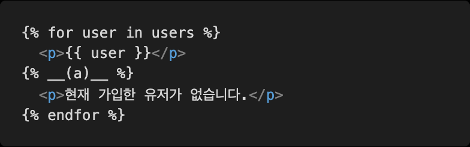
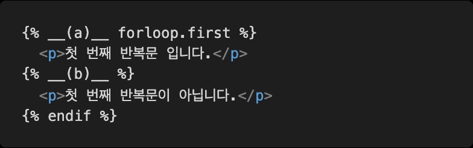
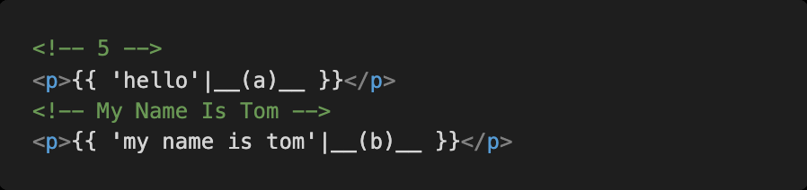
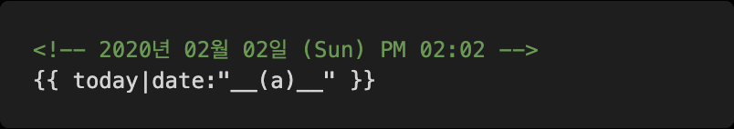
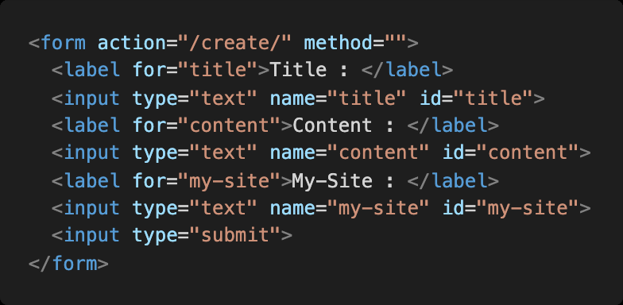

## Django hw01

### 1.한국 시간 나타내기

1.  django 서버를 실행하고 첫 페이지에 접속했을 때 터미널에 출력된 서버 시간이 현재 한국 시간과 다른 시간으로 출력된다 . 이를 한국 시간으로 바꾸려면 settings.py 에 어떤 변수 그리고 어떤 값을 할당해야 하는지 작성하시오.

  ```python
  TIME_ZONE = 'Asia/Seoul' # TIME_ZONE 변수에 Asia/Seoul 할당
  ```

  

2. 추가로 settings.py 에 이 변수 가 False 인 상태로 1-1 번 변수를 설정하는 것은 error 라고 한다 . 이 변수 는 무엇인가


### 2. urls.py

주소 ssafy 로 요청이 들어왔을 때 실행되는 함수가 pages 앱의 views.py 파일 안 ssafy 함수라면 , 요청에 응답하기 위해  빈칸 __(a)__ 에 추가되어야 할 코드를 작성하시오

```python
urlpatterns = [
    path('ssafy/', views.ssafy)
]
```


### 3. Django Template Language

1. menus 리스트를 반복문으로 출력하시오.

   

   → **menu**

2. posts 리스트를 반목문을 활용하여 0 번 글부터 출력하시오.

   

   → **forloop.counter0**

3. users 리스트가 비어있다면 현재 가입한 유저가 없습니다 . 텍스트를 출력하시오

   

   → **empty**

4. 첫 번째 반복문일 때와 아닐 때를 조건문으로 분기처리 하시오.

   

   → **if / endif**

5. 출력된 결과가 주석과 같아지도록 하시오.

   

   → **length / title**


6. 변수 today 에 datetime 객체가 들어있을 때 출력된 결과가 주석과 같아지도록 하시오.

   

   → **Y년 m월 d일 (D) A h : i**


### 4. Form tag with Django



1) 지문의 코드 중 form 태그의 속성인 action 의 역할에 대해 설명하시오.

​	**답)** 입력내용들을 서버에 보내기 위해서 action의 속성값에 **주소**를 넣어줘야한다.

2) 지문의 코드 중 method 가 가질 수 있는 속성 값을 작성하시오.

​	**답)** GET(URL에 폼 데이터를 추가하여 서버로 전달하는 방식) 

​		/ POST( 폼 데이터를 별도로 첨부하여 서버로 전달  하는 방식)

3)  input 태그에 각각 `안녕하세요 ,반갑습니다 ,파이팅 ` 문자열을 넣고 submit 버튼을 눌렀을 때 이동하는 url 경로를 작성하시오.

​		**답)** ~/create/