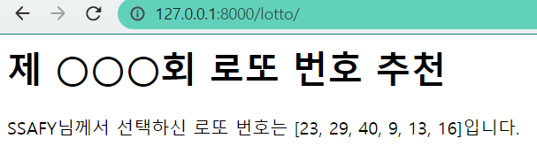

## Django Workshop01

> Django Web Framework 에 대한 이해


#### 0) 결과화면




#### 1. intro/urls.py

```python
from django.contrib import admin
from django.urls import path
from pages import views
urlpatterns = [
    path('admin/', admin.site.urls),
    path('lotto/', views.lotto, name='lotto'),
]
```

#### 2. pages/view.py

```shell
from django.shortcuts import render
import random
# Create your views here.
def lotto(request): # 첫번째 인자는 반드시 request
    num = random.sample(range(1, 46), 6)
    context ={
        'num' : num 
    }
    return render(request, 'lotto.html', context)
```

#### 3. templates/lotto.html

```html
<h1>제 ○○○회 로또 번호 추천</h1>
<p>SSAFY님께서 선택하신 로또 번호는 {{ num }}입니다.</p>
```


