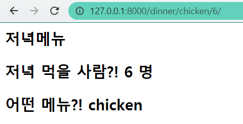

# Django workshop02

> Variable Routing


## 1. 결과 화면



## 2. intro/urls.py

```python
from django.contrib import admin
from django.urls import path
from pages import views
urlpatterns = [
    path('admin/', admin.site.urls),
    path('dinner/<str:menu>/<int:total>/', views.dinner),]
```


### 3. pages/views.py

```python
from django.shortcuts import render

def dinner(request, menu, total):
    context = {
        'menu' : menu,
        'total' : total
    }
    return render(request, 'dinner.html', context)
```


### 4. templates/dinner.html

```html
<h2> 저녁메뉴 </h2>
<h2>저녁 먹을 사람?! {{ total }} 명</h2>
<h2>어떤 메뉴?! {{ menu }}</h2>
```