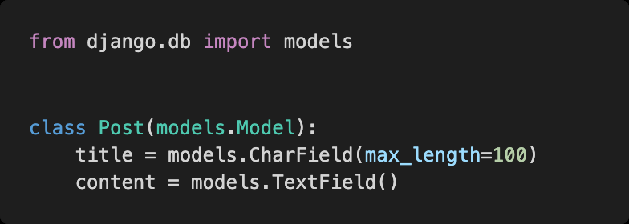
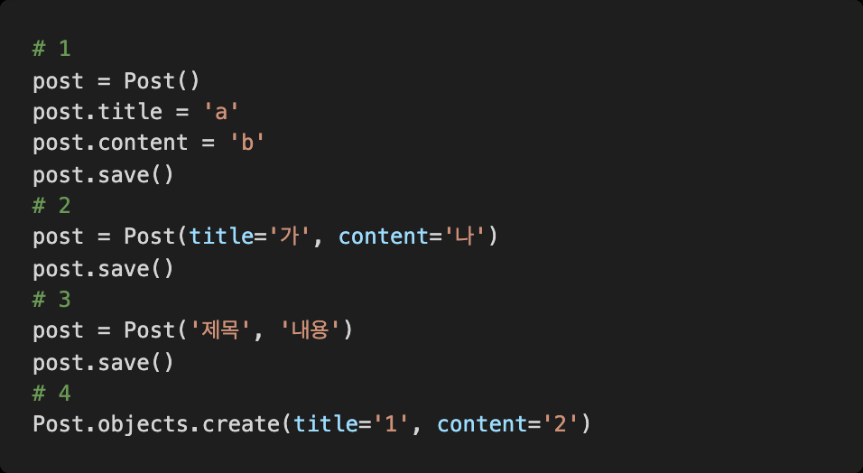
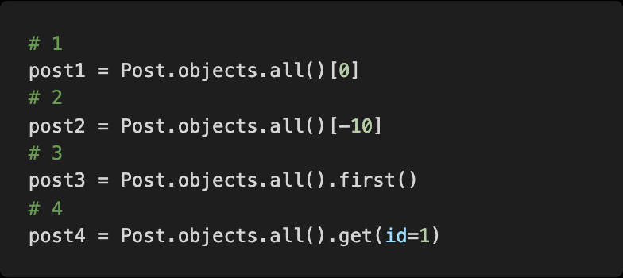

# Django hw04

### Django Model

posts 앱 안의 models.py 파일에 다음과 같은 코드를 작성하였다.

### 1) 

models.py 를 작성한 후 마이그레이션 작업을 위해 터미널에 작성해야 하는 두 개의 핵심 명령어를 작성하시오.

**답)**  python manage.py makemigrations / migrate

### 2)

다음 중 새로운 Post 를 저장하기 위하여 작성한 코드 중 옳지 않은 것을 고르시오.

**답)** 3번

### 3) 

Post 가 10 개 저장되어 있고 id 의 값이 1 부터 10 까지라고 가정할 때 가장 첫 번째 Post 를 가져오려고 한다 . 다음 중 옳지 않은 코드를 고르시오.

**답)** 2번

### 4)

만들어진 모든 Post 객체를 QuerySet 형태로 반환 해주기 위해 빈칸에 들어갈 코드를 작성하시오

**답)** posts = Post.objects.all()