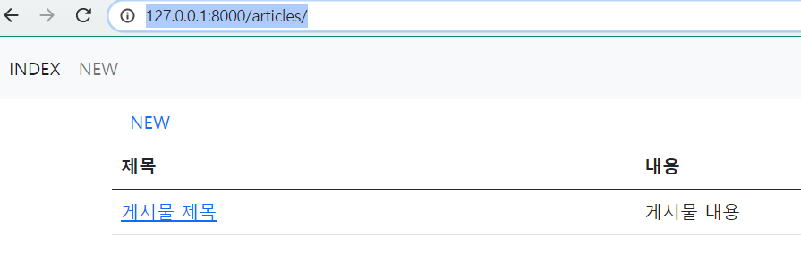
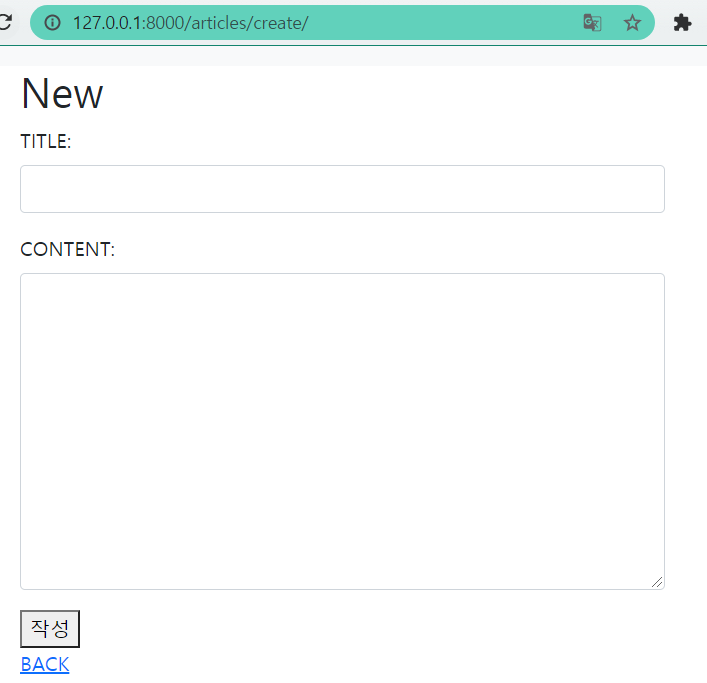
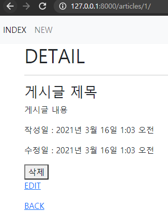
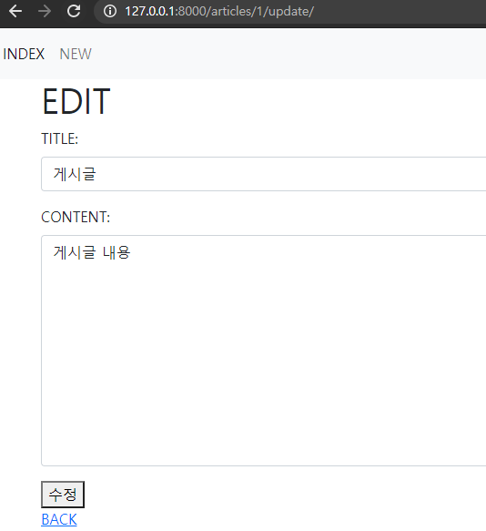

# Django ws04

> Django CRUD

### 1) READ



```python
# urls patterns
path('', views.index, name='index')
# views
def index(request):
    articles = Article.objects.all()
    context = {
        'articles': articles,
    }
    return render(request, 'articles/index.html', context)
```

```html
% extends 'base.html' %}

<a class="nav-link" href="">NEW</a>
  <table class="table">
    <thead>
      <tr>
        <th scope="col">제목</th>
        <th scope="col">내용</th>
      </tr>
    </thead>
    <tbody>
      
        <tr>
          <td><a href="">{{ article.title }}</a></td>
          <td>{{ article.content}}</td>
        </tr>
      
    </tbody>
  </table>

```

### 2) Create



```python
# urls
path('create/', views.create, name='create'),
# views
def create(request):
    return render(request, 'articles/create.html')
```

```html



<h1>New</h1>
<form method="POST">
  
  <div class="mb-3">
    <label for="title" class="form-label">TITLE: </label>
    <input type="text" name="title" class="form-control" id="title" aria-describedby="emailHelp" maxlength="10">
  </div>
  <div class="mb-3">
    <label for="content" class="form-label">CONTENT:</label>
    <textarea name="content" id="content" class="form-control" cols="30" rows="10"></textarea>
  </div>
  <button>작성</button>
  <div>
  <a href="">BACK</a>

  </div>
</form>

```


### 3) Detail



```python
#urls
path('<int:pk>/', views.detail, name='detail'),\
#views
def detail(request, pk):
    article = Article.objects.get(pk=pk)
    context = {
        'article': article
    }
    return render(request, 'articles/detail.html', context)

```

```html


<h1>DETAIL</h1>
<hr>
<h3>{{ article.title }}</h3>
<p>{{ article.content }}</p>
<p>작성일 : {{ article.created_at }}</p>
<p>수정일 : {{ article.updated_at }}</p>
<button> 삭제 </button>
<p><a href="">EDIT</a></p>
 <a href="">DELETE</a> 
<a href="">BACK</a>

```

### 4) Update



```python
#urls
path('<int:pk>/update/', views.update, name='update'),
#views
def update(request, pk):
    article = Article.objects.get(pk=pk)
    article.title = request.GET.get('title')
    article.overview = article.GET.get('content')
    article.save()
    return redirect('article:detail', pk)
```

```html


<h1>EDIT</h1>
<form method="POST">
  <div class="mb-3">
    <label for="title" class="form-label">TITLE: </label>
    <input type="text" name="title" class="form-control" id="title" aria-describedby="emailHelp" maxlength="10" value = {{article.title}}>
  </div>
  <div class="mb-3">
    <label for="content" class="form-label">CONTENT:</label>
    <textarea name="content" id="content" class="form-control" cols="30" rows="10">{{article.content}}</textarea>
  </div>
  <button>수정</button>
  <div>
  <a href="">BACK</a>
  </div>
</form>

```

