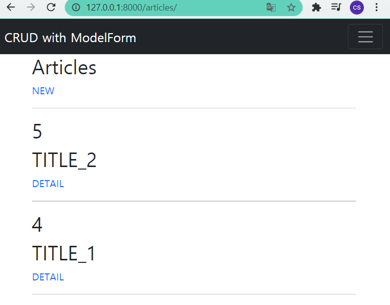
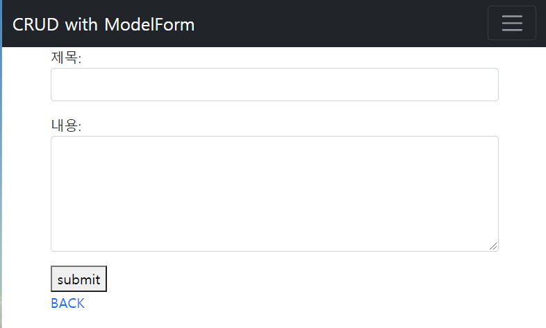
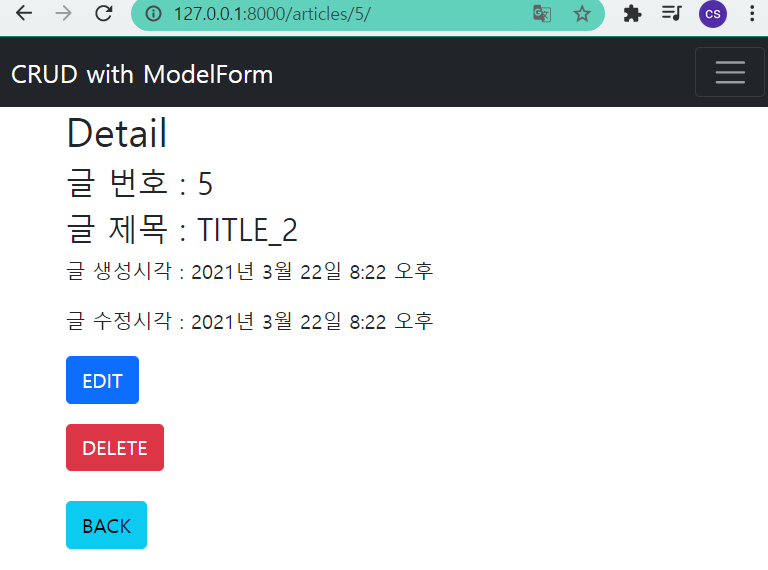
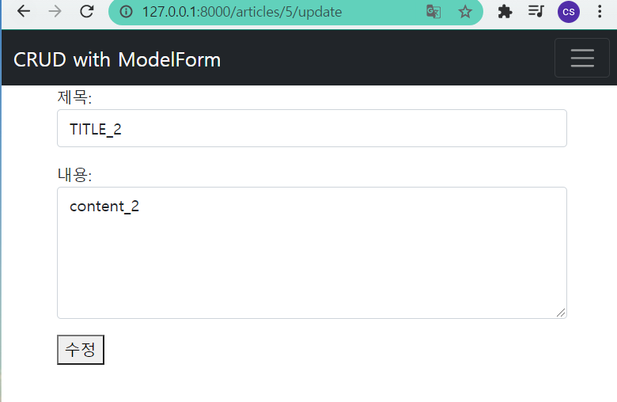

# Django Workshop7

> Django ModelForm


### Django Project
Django Model Form 을 활용해 CRUD 를 모두 갖춘 장고 프로젝트를 제작하고 결과 사진과 코드를 별도의 마크다운 파일에 작성하여 제출하시오 .

**articles / urls.py**

```python
from django.urls import path
from . import views

app_name = 'articles'

urlpatterns = [
    path('', views.index, name='index'),
    path('create/', views.create, name='create'),
    path('<int:pk>/', views.detail, name='detail'),
    path('<int:pk>/update', views.update, name='update'),
    path('<int:pk>/delete', views.delete, name='delete'),
]
```

**articles / models.py**

```python
from django.db import models

# Create your models here.
class Article(models.Model):
    title = models.CharField(max_length=10)
    content = models.TextField(max_length=100)
    created_at = models.DateTimeField(auto_now_add=True)
    updated_at = models.DateTimeField(auto_now=True)
```

**articles / forms.py**

```python

from django import forms
from .models import Article

class ArticleForm(forms.ModelForm):
    title = forms.CharField(
        label='제목',
        widget=forms.TextInput(
            attrs={
                'class': 'form-control',
                'rows': 1,
                'cols': 30,
            }
        )
    )
    content = forms.CharField(
    label='내용',
    widget=forms.Textarea(
        attrs={
            'class': 'form-control',
            'rows': 5,
            'cols': 30,
            }
        )
    )
    class Meta:
        model = Article
        fields = '__all__'
```


### 1. READ



```python
# articles/views.py
def index(request):
    articles = Article.objects.order_by('-pk')
    context = {
        'articles' :articles
    }
    return render(request, 'articles/index.html', context)
```

```html



  <h1>Articles </h1>
  <a style="text-decoration:none" href=""> NEW</a>
  <hr>
  
    <h1>{{ article.pk }} </h1>
    <h1>{{ article.title }} </h1>
    <a style="text-decoration:none" href="">DETAIL</a>
    <hr>  
  

```


### 2. CREATE



```python
def create(request):
    if request.method == 'POST':
        form = ArticleForm(request.POST)
        # 유효성 검사
        if form.is_valid():
            article = form.save()
            return redirect('articles:detail', article.pk)
    else:
        form = ArticleForm()
    context = {
        'form': form
    }
    return render(request, 'articles/create.html', context)
```

```html


    <form method="POST">
    
    {{ form.as_p }}
    <button>submit</button>
    </form>
  <a style="text-decoration:none"  href="">BACK </a>

```


### 3. DETAIL



```python
def detail(request, pk):
    article = get_object_or_404(Article, pk=pk)
    context ={
        'article' : article
    }
    return render(request, 'articles/detail.html', context)
```

```html



 <h1>Detail</h1>
 <h3>글 번호 : {{ article.pk }}</h3>
 <h3>글 제목 : {{ article.title }}</h3>
 <p>글 생성시각 : {{ article.created_at }}</p>
 <p>글 수정시각 : {{ article.updated_at }}</p>
 <a style="text-decoration:none" class="btn btn-primary mb-3" href="">EDIT</a>
  <form action="" method="POST">
    
    <button class="btn btn-danger">DELETE</button>
  </form>
 <br>
 <a style="text-decoration:none"  class="btn btn-info" href="">BACK</a>

```


### 4. UPDATE



```python

@require_http_methods(['GET', 'POST'])
def update(request, pk):
    article = get_object_or_404(Article, pk=pk)

    if request.method == 'POST':
        form = ArticleForm(request.POST, instance=article)
        if form.is_valid():
            form.save()
            return redirect('articles:detail', pk)
    else:
        form = ArticleForm(instance=article)

    context = {
        'form': form
    }
    return render(request, 'articles/update.html', context)

```

```html



<form method="POST">
  
  {{ form.as_p }}
  <button>수정</button>
</form>

```

