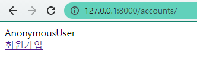
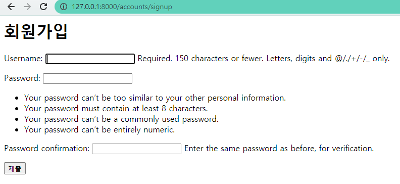

# Django_ws8

> accounts Create / accounts Read


### 1. /accounts/

유저 목록을 출력하는 페이지를 나타낸다.

```python
# accounts / views.py
# request는 굳이 context로 안해도 기본으로 사용 가능
def index(request):
    return render(request, 'accounts/index.html')
```

```html
<div class="container">
    {{ request.user }}
    <br>
    <a href=""> 회원가입</a>
</div>
```




### 2. /accounts/signup/

회원가입 작성을 위한 페이지를 나타낸다. 유저를 생성하는 기능을 수행한다

```python
# accounts / views.py

from django.contrib.auth.forms import UserCreationForm

# 회원가입은 UserCreationForm
def signup(request):
    
    if request.method == 'POST':
        form = UserCreationForm(request.POST)
        if form.is_valid():
            # save 리턴이 user
            user = form.save()
            # 회원 가입 후 자동 로그인 해주는함수
            auth_login(request, user)

    else:
        form = UserCreationForm()
    context = {
        'form' : form,
    }
    return render(request, 'accounts/signup.html', context)
```

```html
<h1>회원가입</h1>

<form action="" method = 'POST'>
  
  {{ form.as_p }}
  <input type="submit">
</form>
```

