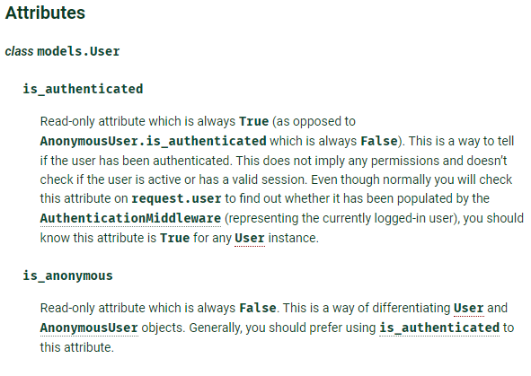

# Django_hw9

> Django Accounts


### 1.  User Model BooleanField

django 에서 기본적으로 사용하는 User 모델은 AbstractUser 모델을 상속받아 정의된다.


- 아래의 models.py 를 참고하여 User 모델에서 사용할 수 있는 칼럼 중 BooleanField
  로 정의 된 컬럼을 모두 작성하시오
  https://github.com/django/django/blob/master/django/contrib/auth/models.py

```python
class AbstractUser(AbstractBaseUser, PermissionsMixin):
  # ...
    is_staff = models.BooleanField(
        _('staff status'),
        default=False,
        help_text=_('Designates whether the user can log into this admin site.'),    )
    is_active = models.BooleanField(
        _('active'),
        default=True,
        help_text=_(
            'Designates whether this user should be treated as active. '
            'Unselect this instead of deleting accounts.'        ),    )
#...
    class Meta:
  #...
```

**답)** : `is_staff` & `is_active`


### 2. username max length
django 에서 기본적으로 사용하는 User 모델의 username 컬럼이 저장할 수 있는 최대 길이를 작성하시오

**답)**  max_length=150


### 3. login validation

단순히 사용자가 로그인 된 사용자인지 만을 확인하기 위하여 User 모델 내부에 정의된 속성 내부에 정의된 속성의 이름을 작성하시오.

참고 : https://docs.djangoproject.com/en/3.0/ref/contrib/auth/#django.contrib.auth.models.User



**답)** **is_anonymous** 


### 4. Login 기능 구현

다음은 로그인 기능을 구현한 코드이다 . 빈 칸에 들어갈 코드를 작성하시오.


**답)** (a) :  AuthenticationForm  (b) : login (c) :   form.get_user()

### 5. who are you?

로그인을 하지 않았을 경우 template 에서 user 변수를 출력했을 때 나오는 클래스의 이름을 작성하시오.

**답)** **anonymous user** 


### 6. 암호화 알고리즘
Django 에서 기본적으로 User 객체의 password 저장에 사용하는 알고리즘 그리고 함께 사용된 해시 함수를 작성하시오.

참고) https://docs.djangoproject.com/en/1.11/topics/auth/passwords/

참고) https://github.com/django/django/blob/main/django/contrib/auth/hashers.py

`Django uses the [PBKDF2](https://en.wikipedia.org/wiki/PBKDF2) algorithm with a SHA256 hash, a password stretching mechanism recommended by [NIST](https://dx.doi.org/10.6028/NIST.SP.800-132). This should be sufficient for most users: it’s quite secure, requiring massive amounts of computing time to break.`


순서 : 해시 → 솔트 → 반복 →  알고리즘

**답)**  알고리즘 : `pbkdf2` (Password-Based Key Derivation Function 2)

해시함수 : git에 `Argon2PasswordHasher` `PBKDF2SHA1PasswordHasher`  등등 많은데 다 사용하는거 같기도하고, 어떤걸 딱 사용하는지는 모르겠어여ㅠ


### 7. Logout 기능 구현

로그아웃 기능을 구현하기 위하여 다음과 같이 코드를 작성하였다 . 로그아웃 기능을 실행 시 문제가 발생한다고 할 때 그 이유와 해결 방법을 작성하시오.


**답)** 함수이름이 똑같아서 django.contrib.auth에서 import 한 logout 함수를 사용하지 못하고 재귀함수 처럼 작동할 수 있다. 따라서,  views.py 상단에서  import 구문을 아래와 같이 작성해야한다.

```python
from django.contrib.auth import logout as auth_logout
from django.contrib.auth import login as auth_login
```

