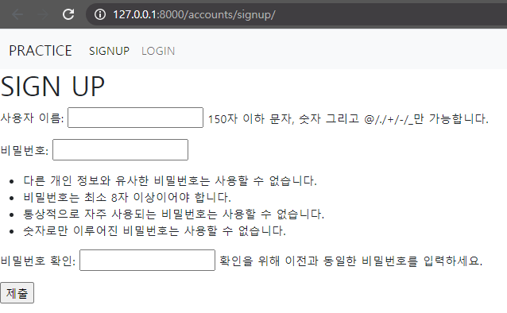
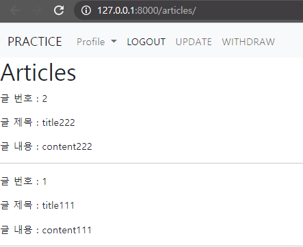
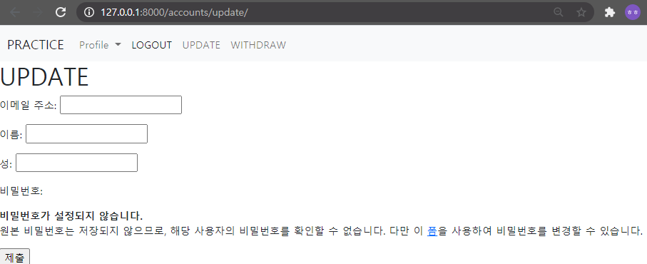

# Django_Practice 2

> User CRUD & Login and Logout


```python
from django.urls import path
from . import views

app_name = 'accounts'

urlpatterns = [
    path('signup/', views.signup, name = 'signup'),
    path('login/', views.login, name = 'login'),
    path('logout/', views.logout, name = 'logout'),
    path('update/', views.update, name = 'update'),
    path('delete/', views.delete, name='delete'),
]
```

### 1. User Create

/accounts/signup/  회원가입 기능을 구현한다



```python
from django.shortcuts import render, redirect
from django.contrib.auth import login as auth_login
from django.contrib.auth import logout as auth_logout
from django.contrib.auth.forms import UserCreationForm
# 회원 가입은 UserCreationForm
def signup(request):

    # 로그인 한 사람은 회원가입이 안보여야 돼
    if request.user.is_authenticated:

        return redirect('articles:index')

    if request.method =='POST':
        form = UserCreationForm(request.POST)
        if form.is_valid():
            user = form.save()
            auth_login(request, user)
            return redirect('articles:index')
    else:
        form = UserCreationForm()
    context = {
        'form' : form,
    }
    return render(request, 'accounts/signup.html', context)
```


### 2. Login

/accounts/login/ 로그인 기능을 구현한다

로그인을 한 경우 nav 에 다음과 같은 정보가 표시된다
1) 로그인 한 유저 정보     2) 로그아웃        3) 회원 수정       4)  회원 탈퇴



```python
from django.shortcuts import render, redirect
from django.contrib.auth import login as auth_login
from django.contrib.auth import logout as auth_logout
from django.contrib.auth.forms import UserCreationForm, AuthenticationForm

# 로그인은 AuthenticationForm
def login(request):
    # 로그인 한 사람은 로그인 페이지 안보여야
    if request.user.is_authenticated:
        return redirect ('articles:index')

    if request.method =='POST':
        form = AuthenticationForm(request, request.POST)
        if form.is_valid():
            user = form.get_user()
            auth_login(request, user)
            return redirect( request.GET.get('next') or 'articles:index')
    else:
        form = AuthenticationForm()
        context = {
             'form' : form,
        }
        return render(request, 'accounts/login.html', context)
```


### 3. Logout

/accounts/logout/  로그아웃 기능을 구현한다
로그아웃을 한 경우 nav 에 다음과 같은 정보가 표시된다
1)  회원가입       2 ) 로그인


```python
def logout(request):
    auth_logout(request)
    return redirect('articles:index')
```


### 4. User Update

/accounts/update/ 회원 정보 수정 기능을 구현한다
회원 정보 수정 페이지에서는 아래의 정보만 수정 할 수 있도록 설정한다
1) 이메일 주소            2) 이름 성



```python
# forms.py
class CustomUserChangeForm(UserChangeForm):
    class Meta:
        model = get_user_model()
        fields = ('email', 'first_name', 'last_name',)
```

```python
from django.shortcuts import render, redirect
from .forms import CustomUserChangeForm

def update(request):
    if request.method == 'POST':
        form = CustomUserChangeForm(request.POST, instance = request.user)
        if form.is_valid():
            form.save()
            return redirect('articles:index')
    else:
        form = CustomUserChangeForm()
        context = {
            'form' : form,
        }
        return render(request, 'accounts/update.html', context)
```


### 5. User Delete

/accounts/delete/ 회원 삭제 기능을 구현한다.
단 POST method 일 때만 삭제할 수 있도록 작성한다

```python
@require_POST
def delete(request):
    if request.is_authenticated:
        request.user.delete()
        auth_logout(request)
    return redirect('articles:index')
```

