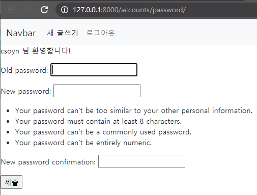

# Django_ws9

> Built in auth forms 에 대한 이해


### User Change Password

/accounts/password/ url 을 가지며 유저의 비밀번호 수정 기능을 구현한다.



```python
# change_password에서 필요한 것들
from django.contrib.auth.decorators import login_required
from django.contrib.auth.forms import PasswordChangeForm
from django.contrib.auth import update_session_auth_hash

# 비밀번호 수정(UPDATE)
# forms.Form 을 상속받은.
@login_required
def change_password(request):
    if request.method == 'POST':
        # 순서중요. update랑 다름.
        form = PasswordChangeForm(request.user, request.POST)
        if form.is_valid():
            form.save()
            # 세션을 유지함 로그아웃 되지 않아
            # 세션 update
            update_session_auth_hash(request, form.user)
            return redirect('articles:index')
    else:
        form = PasswordChangeForm(request.user)
    context = {
        'form':form
    }
    return render(request, 'accounts/change_password.html', context)
```

