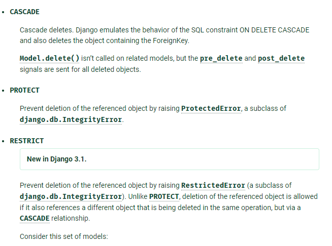
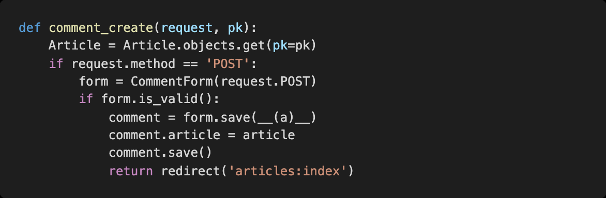
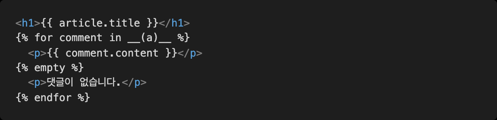

# Django_hw10

> Django Model Relationship


### 1.Lookup

지문의 코드에서 gt ’ 부분을 lookup 이라고 한다 . 링크를 참고하여 Django 에서 사용 가능 한 lookup 세가지와 그 의미를 작성하시오.

https://docs.djangoproject.com/en/3.1/ref/models/querysets/#field-lookups

```python
Entry.objects.filter(pk__gt=4)
```

**답) ** `Field` lookups :  sql문에서 where 문에 해당하는 의미를 가짐.

1) `exact` : 지정

```python
Entry.objects.get(id__exact=14)
Entry.objects.get(id__exact=None)
```

```sql
SELECT ... WHERE id = 14;
SELECT ... WHERE id IS NULL;
```

2) `range` :  between

```python
import datetime
start_date = datetime.date(2005, 1, 1)
end_date = datetime.date(2005, 3, 31)
Entry.objects.filter(pub_date__range=(start_date, end_date))
```

```sql
SELECT ... WHERE pub_date BETWEEN '2005-01-01' and '2005-03-31';
```

3) `isnull` : 결측치 유무

```python
Entry.objects.filter(pub_date__isnull=True)
Entry.objects.filter(pub_date__isnull=False)
```

```sql
SELECT ... WHERE pub_date IS NULL;
SELECT ... WHERE pub_date IS NOT NULL;
```


### 2. 1:N 관계 설정

지문은 1: N 관계 설정을 하기 위하여 정의된 모델이다 . 링크를 참고하여 빈 칸에 들어갈
수 있는 값 세가지를 선택 후 그 의미를 작성하시오
https://docs.djangoproject.com/en/3.1/ref/models/fields/#arguments




1) CASCADE :  ForeignKey를 포함하여 댓글도 삭제.

2) PROTECT : 댓글은 삭제 되지 않음. 무결성 오류(ProtectedError)

3) RESTRICT : 참조된 댓글을 삭제하지 못하도록 하지만, PROTECT와 달리  CASCADE  관계를 통해 삭제되는 다른 댓글도 참조할 경우 삭제할 수 있음.


### 3. comment create view

지문은 댓글 기능을 작성하기 위한 코드이다 . 빈 칸에 들어갈 코드와 의미를 작성하시오.



**답) ** commit=False : 인스턴스는 만드는데 save는 아직 안하겠다. 

```python
comment = comment_form.save(commit=False)
```


### 4. 1:N DB API

게시물 아래에 댓글을 출력하려고 한다 . Article 과 Comment 모델이 1: N 으로 관계설정
이 되어 있다고 가정 할 때 아래의 빈칸에 적절한 코드를 작성하시오.



**답) ** comments