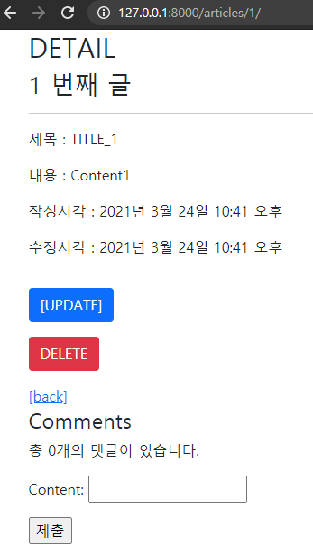
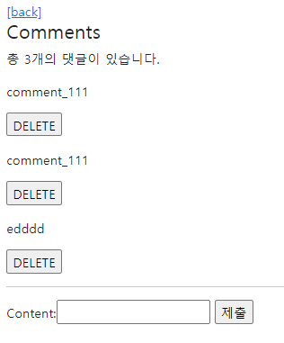

# Django_WS10

> Comment Create & Read & Comment Delete


### 1. Model 댓글 작성을 위한 테이블을 정의한다

```python
# articles / models.py

class Article(models.Model):
    title = models.CharField(max_length=10)
    content = models.TextField()
    created_at = models.DateTimeField(auto_now_add=True)
    updated_at = models.DateTimeField(auto_now=True)

class Comment(models.Model):
    article = models.ForeignKey(Article, on_delete=models.CASCADE)
    content = models.CharField(max_length=200)
    ow_add=True)
    updated_at = models.DateTimeField(auto_now=True)
    
    
# articles / forms.py
from django import forms
from .models import Article, Comment

class ArticleForm(forms.ModelForm):

    class Meta:
        model = Article
        fields = '__all__'
        # exclude = ('title',)

class CommentForm(forms.ModelForm):

    class Meta:
        model = Comment
        exclude = ('articles', )
```


### 2. Comment Create & 3. Comment Read
URL : /articles/<article_pk >/comments/  댓글 작성 기능을 구현한다.

댓글 읽기 기능을 구현한다. 상세 페이지 하단에 댓글 목록을 출력한다.

#### comments_create인자 pk 까먹지 말아라....

```python
# articles/urls.py
path('<int:articles_pk>/comments/', views.comments_create, name='comments_create'),

# articles/views.py
from django.shortcuts import render, redirect, get_object_or_404
from django.views.decorators.http import require_safe, require_http_methods, require_POST
from .models import Article, Comment
from .forms import ArticleForm, CommentForm

@require_POST
def comments_create(request,pk):
    # 댓글 달 게시글이 필요.
    article = get_object_or_404(Article, pk=pk)
    # 댓글 창
    comment_form = CommentForm(request.POST)
    # 댓글이 유효하면
    if comment_form.is_valid():
        # 인스터스 생성, but 아직 노 저장
        comment = comment_form.save(commit=False)
        # 어느 게시글의 댓글인지 확정하고
        comment.article = article
        # 저장
        comment.save()
        return redirect('articles:detail', articles.pk)
    context = {
        'comment_form' : comment_form,
        'article' : article
    }
    return render(request, 'articles/detail.html', context)
```

```python
# articles/views.py

@require_safe
def detail(request, pk):
    article = get_object_or_404(Article, pk=pk)
    # detail 창에서 댓글들을 read,create 할 수 있어야 함.
    comment_form = CommentForm()
    comments = article.comment_set.all()
    context = {
        'article': article,
        'comments': comments,
    }
    return render(request, 'articles/detail.html', context)

```

```html
{# ... #}
{# detial.html #}
  <h4>Comments</h4>

  <p>총 {{ comments|length }}개의 댓글이 있습니다.</p>

   <form action="" method = "POST">
    
    {{ comment_form.as_p }}
    <input type="submit">
  </form>

  
    {{ comment }} 
  
```





### 4. Comment Delete

댓글 삭제 기능을 구현한다.

```python
# views.py
@require_POST
def delete(request, pk):
    article = get_object_or_404(Article, pk=pk)
    article.delete()
    return redirect('articles:index')
```


