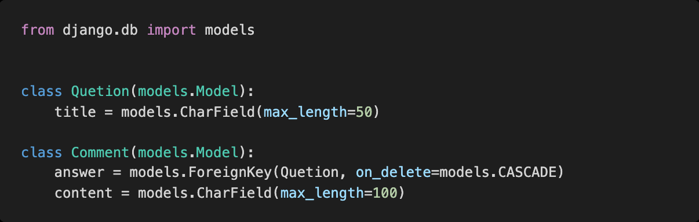
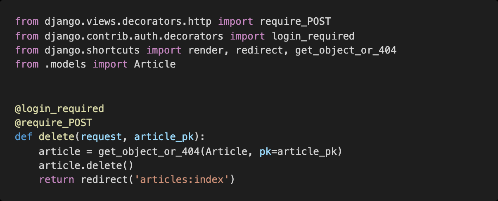
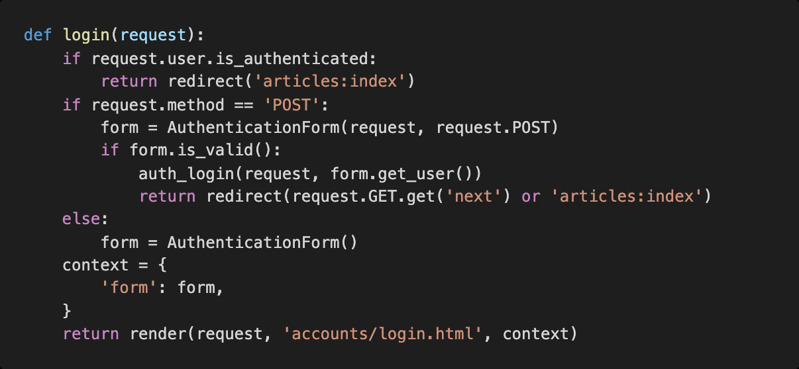

# Django HW12

> Django 1:N Model Relation


### 1. 1:N True or False

1) ForeignKey 는 부모 테이블의 데이터를 참조하기 위한 키이다				**T**

2) 1: N 관계에서 1 은 N 의 데이터를 직접 참조 할 수 있다		      			  **F**

3) on_delete 속성은 ForeignKey 필드의 필수 인자이다			 	  		 	**T**

4) 1: N 관계에서 외래 키는 반드시 부모 테이블의 PrimaryKey 여야 한다.  **F**


### 2. ForeignKey column name

다음과같이 이름이 articles 인 app 의 models.py 에 작성된 코드를 바탕으로 테이블이 만들어 졌을 때 , 데이터베이스에 저장되는 ForeignKey 컬럼의 이름과 테이블의 이름이 무엇인지 작성하시오



**답 ) answer_id**

Foreignkey는 DB에 _id를 붙여 DB에 저장함.


### 3. 1:N model manager

위 2 번 문제 모델 관계를 바탕으로 어느 template 페이지가 다음과 같이 작성되어 있을 때 , 질문 Question) 에 작성된 모든 댓글 Comment) 을 출력하고자 한다 . 해당 template 에서 Question 객체를 사용할 수 있다면 빈칸 a)__ 에 들어갈 알맞은 코드를 작성하시오.


**답 ) Question.comment_set.all()**


### 4. next prameter
다음과 같이 게시글을 삭제하는 delete 함수와 로그인을 위한 login 함수가 작성되어 있다.
만약 비로그인 사용자가 삭제를 시도한다면 django는 해당 사용자를 url에 next 파라미터가
붙은 login 페이지로 redirect 한다.

▪ /accounts/login/?next=/articles/1/delete/

1) redirect된 로그인 페이지에서 로그인에 성공했을 때 발생하는 HTTP response status
code를 작성하고 발생한 원인과 해결을 위해 코드를 수정하시오.

▪ 게시글 삭제는 HTTP POST method로만 가능하다.

▪ 인증되지 않은 사용자는 메인페이지로 redirect 되어야 한다.





**답)** delete함수의 데코레이터 @login_required 와 @require_POST가 충돌

 `@require_POST` 가 있는 함수에 `@login_required` 가 설정 된다면 로그인 이후 `"next"` 매개변수를 따라 해당 함수로 다시 redirect 되면서 `@require_POST` 때문에 405 에러가 발생

 **redirect 중 POST 데이터의 손실** &  애초에 **redirect 는 POST Request 가 불가능**하여 GET Request 로 요청

```python
@require_POST
def delete(request, pk):
    if request.user.is_authenticated:
        article = Article.objects.get(pk=pk)
        article.delete()
    return redirect('articles:index')
```

