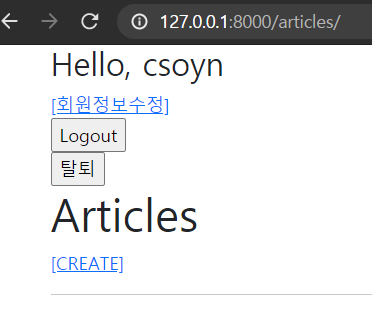
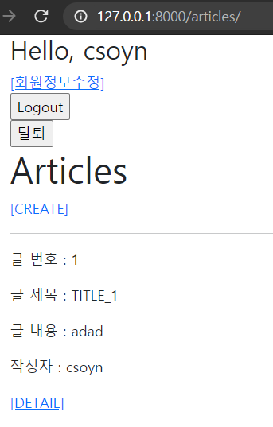
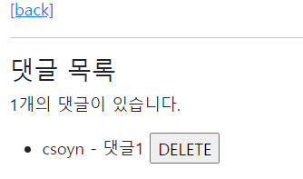

#  Django_WS12

> User 와 Article, Comment 간 1:N Model Relation


### Django Project
사전 제공되는 프로젝트를 사용해 아래 해당하는 조건을 모두 구현 하시오.

1) 대체한 User model 을 사용한다.

```python
### models.py
from django.db import models
from django.contrib.auth.models import AbstractUser
# Create your models here.
class User(AbstractUser):
    pass

### admin.py
from django.contrib import admin
from django.contrib.auth.admin import UserAdmin
from .models import User

admin.site.register(User, UserAdmin)

### settings.py
AUTH_USER_MODEL = 'accounts.user'
```

```python
### articles/views.py
# user = models.ForeignKey(settings.AUTH_USER_MODEL, on_delete=models.CASCADE)

class Article(models.Model):
    title = models.CharField(max_length=10)
    content = models.TextField()
    created_at = models.DateTimeField(auto_now_add=True)
    updated_at = models.DateTimeField(auto_now=True)
    user = models.ForeignKey(settings.AUTH_USER_MODEL, on_delete=models.CASCADE)

class Comment(models.Model):
    article = models.ForeignKey(Article, on_delete=models.CASCADE)
    content = models.CharField(max_length=200)
    created_at = models.DateTimeField(auto_now_add=True)
    updated_at = models.DateTimeField(auto_now=True)
    user = models.ForeignKey(settings.AUTH_USER_MODEL, on_delete=models.CASCADE)

​```
create 동작에 
article.user = request.user
comment.user = request.user 추가
​```
```


2) 회원가입이 정상적으로 동작한다.

```python
# forms.py 추가
class CustomUserCreationForm(UserCreationForm):
    class Meta(UserCreationForm.Meta):
        model = get_user_model()
        fields = UserCreationForm.Meta.fields
```

```python
# UserCreationForm -> CustomUserCreationForm 수정

@require_http_methods(['GET', 'POST'])
def signup(request):
    if request.user.is_authenticated:
        return redirect('articles:index')

    if request.method == 'POST':
        form = CustomUserCreationForm(request.POST)
        if form.is_valid():
            user = form.save()
            auth_login(request, user)
            return redirect('articles:index')
    else:
        form = CustomUserCreationForm()
    context = {
        'form': form,
    }
    return render(request, 'accounts/signup.html', context)

```



3) 메인 페이지에서 각 게시글의 작성자 정보가 출력된다.

```html
{# index.html 추가#}
<p>작성자 : {{ article.user }}</p>
```



4) 게시글 작성자 본인만 게시글을 수정 및 삭제할 수 있다.

```python
# if request.user == article.user: 추가

@login_required
@require_http_methods(['GET', 'POST'])
def update(request, pk):
    article = get_object_or_404(Article, pk=pk)
    if request.user == article.user:

        if request.method == 'POST':
            form = ArticleForm(request.POST, instance=article)
            if form.is_valid():
                form.save()
                return redirect('articles:detail', article.pk)
        else:
            form = ArticleForm(instance=article)
    else:
        return redirect('articles:index')
        
    context = {
        'form': form,
        'article': article,
    }
    return render(request, 'articles/update.html', context)

@require_POST
def delete(request, pk):
    article = get_object_or_404(Article, pk=pk)
    if request.user.is_authenticated:
        if request.user == article.user:
            article.delete()
            return redirect('articles:index')
    return redirect('articles:detail', article.pk)
```


5) 각 댓글에는 댓글 작성자 정보가 출력된다.

````html
{# detail.html에 추가 #}
{{ comment.user }} 
````




6) 댓글 작성자 본인만 댓글을 삭제할 수 있다

```python
# if request.user == comment.user: 추가

@require_POST
def comments_delete(request, article_pk, comment_pk):
    if request.user.is_authenticated:
        comment = get_object_or_404(Comment, pk=comment_pk)
        if request.user == comment.user:
            comment.delete()
    return redirect('articles:detail', article_pk)
```

