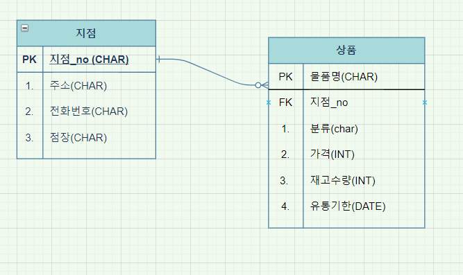

# Django_Hw13

> ERD 작성

### Modeling

편의점 상품 관리 프로그램을 제작하기 위해 모델링을 해야하는 업무가 주어졌다 .
“모델링" 은 개발해야 할 소프트웨어의 밑그림으로써 반드시 먼저 고려해야 할 중요한 요소 중 하나이다

### ERD

다음 조건을 참고하여 ERD 와 models.py 를 자유롭게 작성하고 , 작성한 모델링에 대한
소개와 작성하게 된 이유에 대해 간략히 설명하시오.

1) 지점별 편의점들이 존재한다

2) 각 상품들은 특정 조건별로 분류 할 수 있다

3) 단 , User 는 고려하지 않는다.

---

한 지점에는 여러개의 물품이있어야하고 ,물품은 여러 지점에 존재한다.!! (m:n)관계...?

- 지점 : 지점명(char20) / 주소(char50) / 전화번호(char13) / 점장(char10) / 
  - PK : 지점_no 
- 지점
- 상품 : 물품명(char) / 분류(char)/ 가격(INT) / 재고수량(INT) / 유통기한(datetime)
  - PK : 상품_no
  - FK : 지점_no

