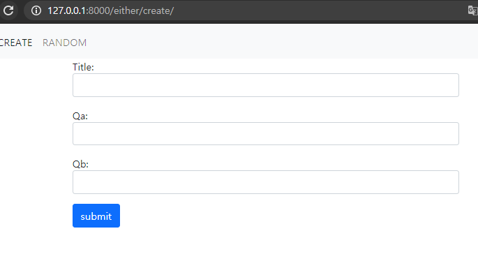
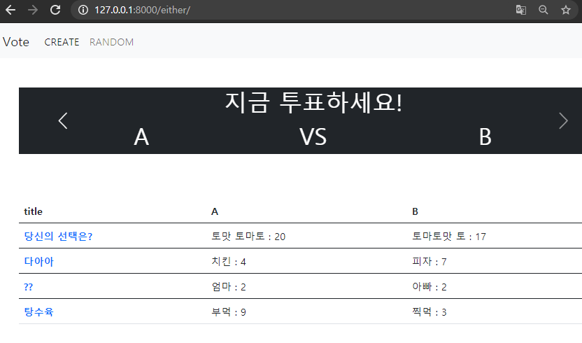
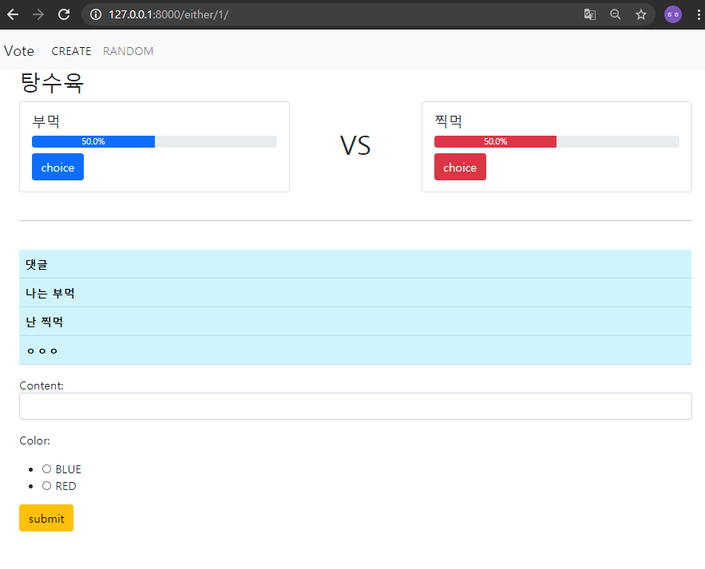
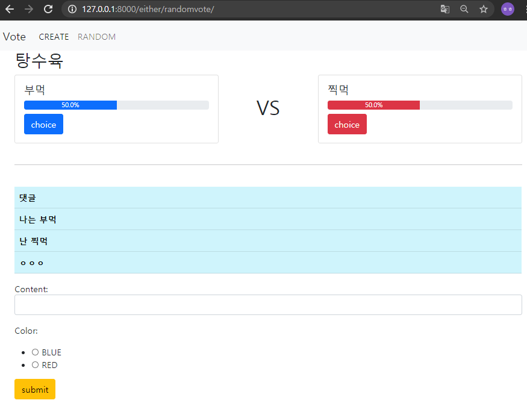

# Django_ws13

> Either Project 제작


### Django Project 

1) 투표는 생성 및 조회가 가능합니다. 

[생성]



[조회]



2) 투표는 주제와 주제에 맞는 항목 2개를 가지고 있습니다.

3) 댓글은 생성 및 조회가 가능합니다.

4) 댓글은 하나의 투표에 여러 개가 작성 될 수 있습니다. 

5) 댓글은 투표 문제 중 하나를 반드시 선택해야 합니다. 

7) 투표 조회 페이지에서는 항목별 댓글 개수를 통해 두 항목간 선택 비율을 출력합니다.



6) random 링크를 클릭하면 투표 조회페이지가 랜덤으로 렌더링됩니다.

네비게이션 바의 random을 누르면 randomvote url로 이동하여, random으로 문제가 나온다.




#### Model 과 Form

```python
# models.py
from django.db import models

class Vote(models.Model):
    Title = models.CharField(max_length=50)
    qa = models.CharField(max_length=50)
    qa_n = models.IntegerField()
    qb = models.CharField(max_length=50)
    qb_n = models.IntegerField()


class Comment(models.Model):
    vote = models.ForeignKey(Vote, on_delete = models.CASCADE)
    content = models.CharField(max_length=200)
    
# forms.py
from .models import Vote, Comment
from django import forms

class VoteForm(forms.ModelForm):
    Title = forms.CharField(
        widget = forms.TextInput(
            attrs={
                'class': 'form-control',            }        )    )
    
    qa = forms.CharField(
        widget = forms.TextInput(
            attrs={
                'class': 'form-control',            }        )    )
    
    qb = forms.CharField(
        widget = forms.TextInput(
            attrs={
                'class': 'form-control',            }        )    )
    class Meta:
        model = Vote
        exclude = ('qa_n' , 'qb_n' ,)

class CommentForm(forms.ModelForm):
    content = forms.CharField(
        widget = forms.TextInput(
            attrs={
                'class': 'form-control',            }        )    )
    BLUE = 'b'
    RED = 'r'
    color = [(BLUE, 'BLUE') ,
     (RED, 'RED')]
    color = forms.ChoiceField(choices=color, widget=forms.RadioSelect)
    class Meta:
        model = Comment
        exclude = ('vote', )

```

#### Url과 View

```python
# urls.py
from django.urls import path
from . import views

app_name = 'either'

urlpatterns = [
    path('', views.index, name ='index'),
    path('create/', views.create, name ='create'),
    path('<int:pk>/', views.detail, name ='detail'),
    path('<int:pk>/increase_a', views.increase_a, name ='increase_a'),
    path('<int:pk>/increase_b', views.increase_b, name ='increase_b'),
    path('randomvote/', views.randomvote, name ='randomvote'),
    path('<int:pk>/comment/', views.comment_create, name ='comment_create'),

]

```

```python
# views.py
from django.shortcuts import render, redirect, get_object_or_404
from .models import Vote, Comment
from .forms import VoteForm, CommentForm
from django.views.decorators.http import require_POST
import random


# 전체 조회 
def index(request):
    votes = Vote.objects.all()
    context = {
        'votes' : votes,
    }
    return render(request, 'either/index.html' , context)

# 투표. 문제 만들기
def create(request):
    if request.method == 'POST':
        form = VoteForm(request.POST)
        if form.is_valid():
            vote = form.save(commit=False)
            vote.qa_n = 0
            vote.qb_n = 0
            vote.save()
        return redirect('either:index')
    else:
        form = VoteForm()
    context = {
        'form' : form,
    }
    return render(request, 'either/create.html', context)

# 한 문제에 대한 상세 페이지
def detail(request, pk):
    vote = get_object_or_404(Vote, pk=pk)
    comment_form = CommentForm()
    comments = vote.comment_set.all()

    if vote.qa_n > 0 and vote.qb_n > 0:
        vote_a_percent = round(vote.qa_n / (vote.qa_n + vote.qb_n) * 100, 1)
        vote_b_percent = round(vote.qb_n / (vote.qa_n + vote.qb_n) * 100, 1)
    elif vote.qa_n == 0 and vote.qb_n == 0:
        vote_a_percent = 0
        vote_b_percent = 0
    elif vote.qa_n == 0 and vote.qb_n > 0:
        vote_a_percent = 0
        vote_b_percent = 100
    elif vote.qa_n > 0 and vote.qb_n == 0:
        vote_a_percent = 100
        vote_b_percent = 0

    context ={
        'vote': vote,
        'comment_form': comment_form,
        'comments': comments,
        'vote_a_percent': vote_a_percent,
        'vote_b_percent': vote_b_percent,
    }
    return render(request, 'either/detail.html', context)

# 댓글 작성
@require_POST
def comment_create(request, pk):
    form = CommentForm(request.POST)
    vote = get_object_or_404(Vote, pk = pk)
    if form.is_valid():
        comment = form.save(commit=False)
        comment.vote = vote
        comment.save()
        return redirect('either:detail' , vote.pk)

# choice_a를 누르면 실행되는 함수
def increase_a(request, pk):
    vote = get_object_or_404(Vote, pk = pk)
    vote.qa_n += 1
    vote.save()
    return redirect('either:detail' , vote.pk)

# choice_b를 누르면 실행되는 함수
def increase_b(request, pk):
    vote = get_object_or_404(Vote, pk = pk)
    vote.qb_n += 1
    vote.save()
    # vote.qa_n.save()
    return redirect('either:detail' , vote.pk)

# random으로 문제를 보여주는 함수
def randomvote(request):
    votes = Vote.objects.all()
    vote = random.choice(votes)
    comment_form = CommentForm()
    comments = vote.comment_set.all()

    if vote.qa_n > 0 and vote.qb_n > 0:
        vote_a_percent = round(vote.qa_n / (vote.qa_n + vote.qb_n) * 100, 1)
        vote_b_percent = round(vote.qb_n / (vote.qa_n + vote.qb_n) * 100, 1)
    elif vote.qa_n == 0 and vote.qb_n == 0:
        vote_a_percent = 0
        vote_b_percent = 0
    elif vote.qa_n == 0 and vote.qb_n > 0:
        vote_a_percent = 0
        vote_b_percent = 100
    elif vote.qa_n > 0 and vote.qb_n == 0:
        vote_a_percent = 100
        vote_b_percent = 0

    context ={
        'vote': vote,
        'comment_form': comment_form,
        'comments': comments,
        'vote_a_percent': vote_a_percent,
        'vote_b_percent': vote_b_percent,
    }
    return render(request, 'either/detail.html', context)
```

