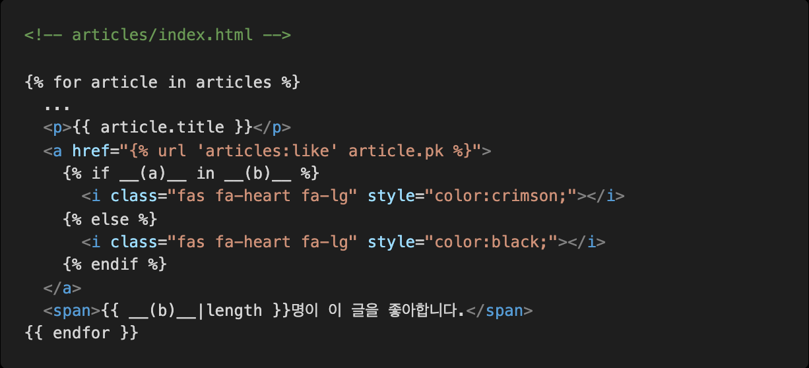
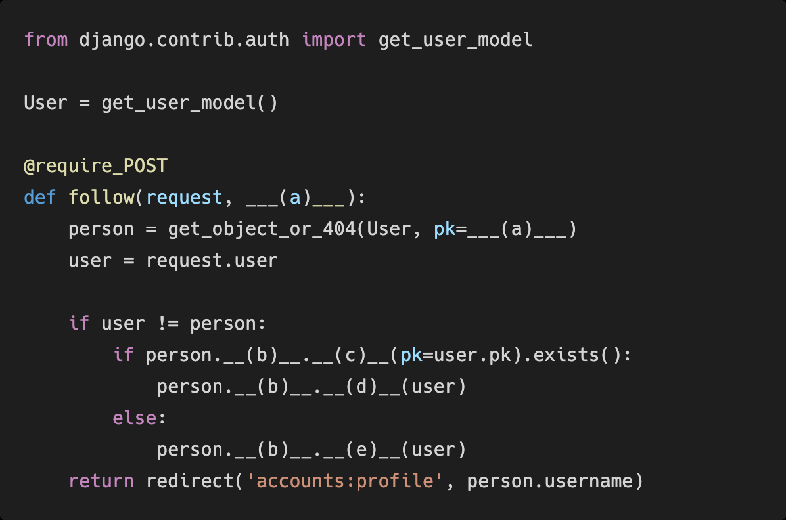
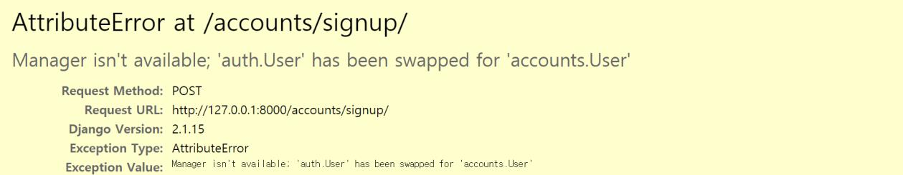
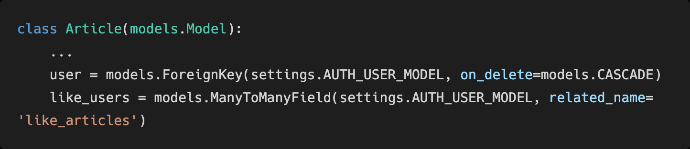
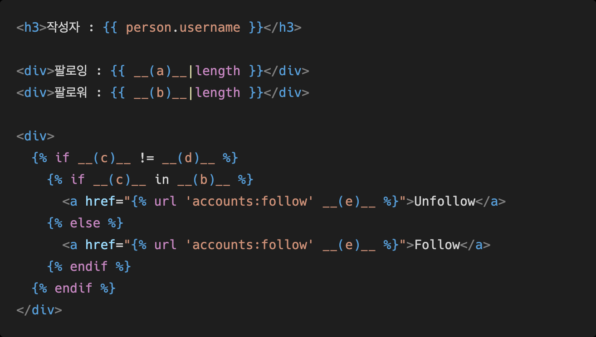

# Django_HW14

> Django Model Relation


### 1. M:N True or False 

각 문항을 읽고 맞으면 T, 틀리면 F를 작성하고 틀렸다면 그 이유도 함께 작성하시오. 

1) Django에서 1:N 관계는 ForeignKeyField를 사용, M:N 관계는 ManyToManyField를 사용한다.  **T**

2) ManyToManyField를 설정하고 만들어지는 테이블 이름은 “앱이름__클래스이름__지정한 필드이름”의 형태로 만들어진다. **F  앱(hospitals)    mtmfield있는 class (patient)    참조하는(doctors)**

3) ManyToManyField의 첫번째 인자는 참조할 모델, 두번째 인자는 related_name이 작성 되는데 두 가지 모두 필수적으로 들어가야 한다. **F  related_name은 필수인자가 아니다.(역참조시 사용할 매니저 이름)** 

### 2. Like in templates 

아래 빈 칸 (a)와 (b)에 들어갈 코드를 각각 작성하시오.

```python
from django.db import models
from django.conf import settings

class Article(models.Model):
    user = models.ForeignKey(settings.AUTH_USER_MODEL, on_delete=models.CASCADE)
    like_users = models.ManyToManyField(settings.AUTH_USER_MODEL, related_name='like_articles')
    #...
```

 

**답 )** (a) : request.user / article.like_users.all


### 3. Follow in views
모델 정보가 다음과 같을 때 빈칸 (a)와 (b)에 들어갈 코드를 각각 작성하시오.

```python
# models.py
from django.db import models
from django.contrib.auth.models import AbstractUser

class User(AbstractUser):
    followings = models.ManyToManyField('self', symmetrical=False, related_name='followers')
    
# urls.py
    path('<int:user_pk>/follow/', views.follow, name='follow'),

```



**답)** (a)  user_pk  / (b):followers / (c): filter / (d): remove / (e) : remove

### 4. User AttributeError

아래와 같은 에러 메시지가 발생하는 이유와 이를 해결하기 위한 방법과 코드를 작성하시오. 




**답**) User를 Custom 하고, Custom 한 User를 사용하고 있지만, 프로젝트 settings.py에 AUTH_USER_MODEL = 'accounts.User'를 하지 않아 에러가 발생


### 5. related_name

아래의 경우 related_name을 필수적으로 설정해야 한다. 그 이유를 설명하시오. 



**답)**

User와 Article은 1:N 관계 M:N 관계가 있음. 각 관계에서 역참조 시 동일한 구문으로 역참조 하게 된다.

```python
# 1:N
# 유저가 작성한 모든 게시글
user.article_set
# M:N
# 유저가 좋아요를 누른 게시글
user.article_set
```


### 6. follow templates
person 변수에는 view함수에서 넘어온 유저 정보가 담겨 있고, 모델 정보가 아래와 같을 때 빈칸 a, b, c, d, e에 들어갈 알맞은 코드를 각각 작성하시오.

```python
# ursl.py
    path('<int:user_pk>/follow/', views.follow, name='follow'),

# models.py
from django.db import models
from django.contrib.auth.models import AbstractUser

class User(AbstractUser):
    followings = models.ManyToManyField('self', symmetrical=False, related_name='followers')
```




**답)**  (a) : followings  	/  (b) : followers	/ (c) : request.user	/ (d) : person	/ (e) : person.pk