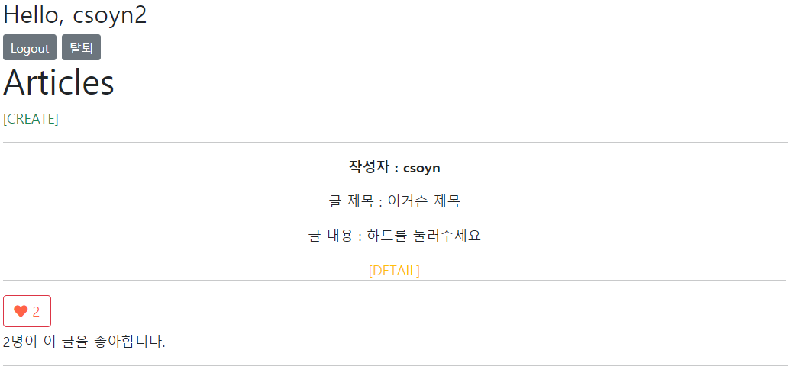
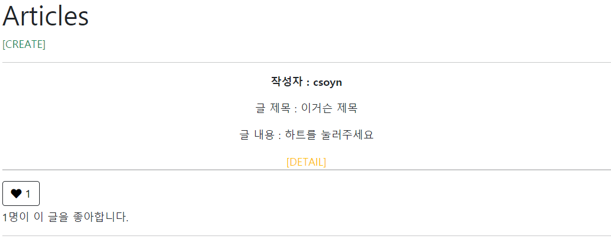

# Django_ws14

> 데이터베이스 M:N 관계를 활용해 좋아요 기능을 구현

### 1. Model

좋아요기능 구현을 위한 컬럼을 추가한다.

```python
from django.db import models
from django.conf import settings

class Article(models.Model):
    user = models.ForeignKey(settings.AUTH_USER_MODEL, on_delete=models.CASCADE)

    # 게시글에 좋아요를 누를 사람들 
    like_users = models.ManyToManyField(settings.AUTH_USER_MODEL, related_name='like_articles')

    title = models.CharField(max_length=10)
    content = models.TextField()
    created_at = models.DateTimeField(auto_now_add=True)
    updated_at = models.DateTimeField(auto_now=True)
```


### 2. url & view

/articles/<article_pk >/ & 로그인한 유저의 요청만 처리한다.

```python
# urls
path('<int:article_pk>/like/', views.like, name='like'),

# view
@require_POST
def like(request, article_pk):
    if request.user.is_authenticated:
        article = get_object_or_404(Article, pk=article_pk)
        # 현재 요청하는 유저의 pk가 like_users에 있다면, 좋아요 취소
        if article.like_users.filter(pk = request.user.pk).exists():
            article.like_users.remove(request.user)
            # 좋아요
        else:
             article.like_users.add(request.user)
        return redirect('articles:index')
    return redirect('accounts:login')
```


### 3. Template

##### 좋아요를 누른 경우



##### 좋아요를 누르지 않은 경우



