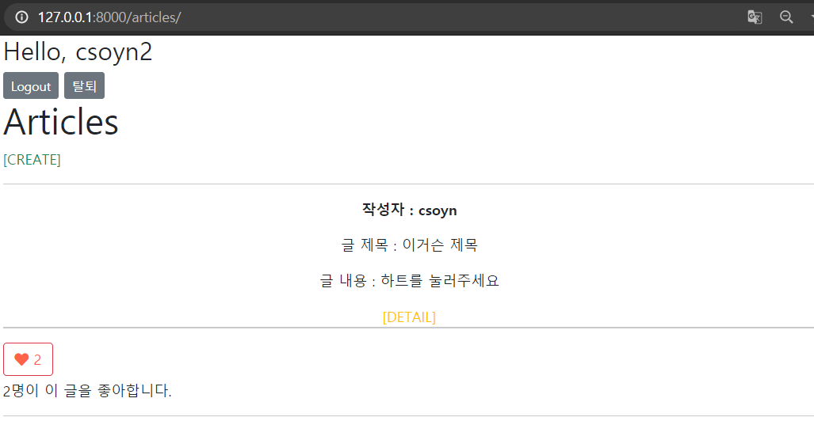
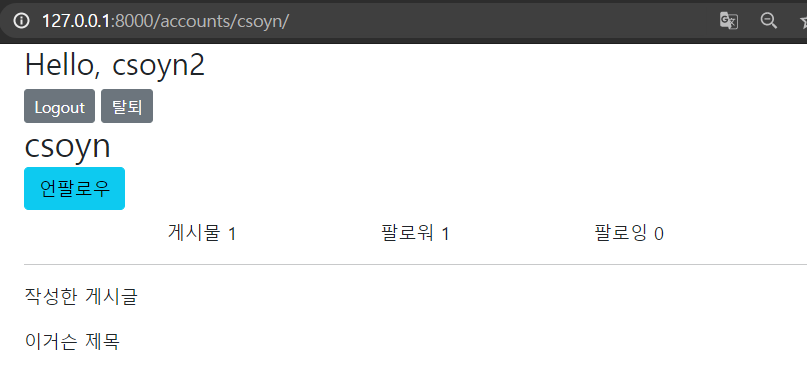
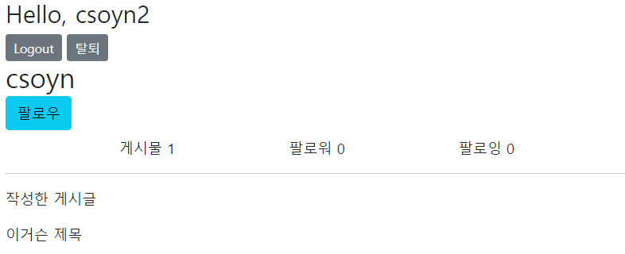

#  Django_ws15

> 데이터베이스 M:N 관계를 활용하여 팔로우 기능


### 1. Model & Form
팔로우 기능 구현을 위한 모델을 세팅한다 /  팔로우 기능을 구현하기 위해 User 모델을 대체한다

```python
from django.db import models
from django.contrib.auth.models import AbstractUser

class User(AbstractUser):
    followings = models.ManyToManyField('self', symmetrical=False, related_name='followers')
# accounts_user_fllowings 테이블이 생기고, from_user_id / to_user_id 열이 생김.
```


### 2. url & view 

##### 프로필과 팔로잉

```python
    ## urls.py
    # 프로필
    path('<str : username>/', views.profile, name='profile'),
    # 팔로잉 user_pk 요사람을 팔로우 하게따
    path('<int:user_pk>/follow/', views.follow, name='follow'),
```


### 3. template

##### index 에서 작성자 눌러서 profile




##### csoyn2 가 csoyn을 팔로우 할 때



##### csoyn2 가 csoyn을 팔로우 하지 않을 때

