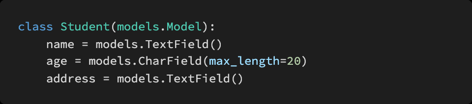

# Django16

> Django  Rest Framework


### 1. T/F

- URI 는 정보의 자원을 표현하고 자원에 대한 행위는 HTTP Method 로 표현한다.  **T**
  - REST의 구성 : 자원(resource) URI / 행위  HTTP Method / 표현 Respresentations
-  HTTP Method 는 GET 과 POST 두 종류가 있다  **F** 
  - GET, POST, PUT(요청한 주소의 자원(resource)을 수정), DELETE(지정한 자원(resource)을 삭제)
- 일반적으로 URI 마지막에 슬래시 ( /) 는 포함하지 않는다 **T **
- https://www.fifa.worldcup/teams/team/43822/create/ 는 계층 관계를 잘 표현한 RESTful 한 URI 라고 할 수 있다  **F** 
  - create라는 

 

### 2. 다음의 HTTP status code 의 의미를 간략하게 작성하시오.

- 200 :  OK / 요청이 성공적이다 
- 400 : Bad Request / 요청을 이해할 수 없음 (잘못된 문법)
- 401 : Unauthorized / 비인증상태. 클라이언트가 요청한 응답을 받기 위해서는 인증을 해야함 
- 403 : Forbidden / 클라이언트는 접근할 권리를 가지고 있지 않음. 미승인 → 서버 적절한 거절 응답
- 404 : Not Found / 서버는 요청받은 리소스를 찾을 수 없음. 
- 500 : Internal Server Error / 서버가 요청을 처리하는 방법을 모르는 상황


### 3. 아래의 모델을 바탕으로 Serializer 를 정의하려 한다 . serializers.py 파일에 StudentSerializer 를 작성하시오



```python
from rest_framework import serializers
from .models import Student

class StudentSerializer(serializers.ModelSerializer):

    class Meta:
        model = Student
        fields = '__all__'
```


### 4. Serializers 의 의미를 DRF(Django REST Framework) 공식 문서 를 참고하여 간단하게 설명.

- Serializer은 쿼리셋이나 모델 instance와 같은 복잡한 데이터를 native Python datatype(JSON, XML과 같은)으로 변환하여 쉽게 render해줄 수 있도록 해준다.
- REST Famework의 serializer는 Django의 Form과 ModelForm class와 매우 유사하게 작동한다.