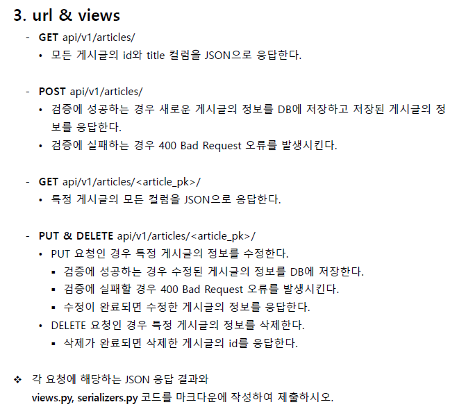
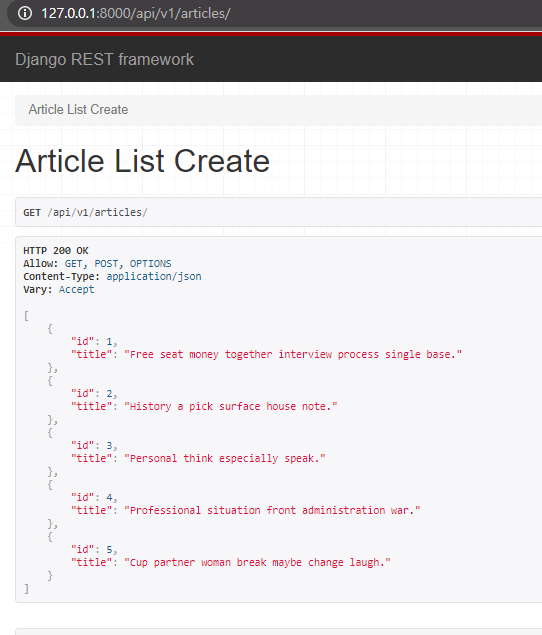
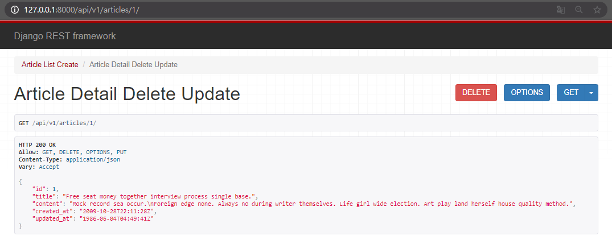

# Django workshop16

> DRF(Django REST Framework) 에 대한 이해


### 1. Model & Admin

**Article** : title, content, created_at , updated_at 컬럼이 존재한다
관리자 페이지 혹은 djang seed 라이브러리를 활용하여 5 개의 게시글을 생성한다

```python
from django.db import models

# Create your models here.

class Article(models.Model):
    title = models.CharField(max_length=100)
    content = models.TextField()
    created_at = models.DateTimeField(auto_now_add=True)
    updated_at = models.DateTimeField(auto_now=True)
```

```bash
python manage.py seed articles --number=5
```


### 2. serializers
**ArticleListSerializer** : 모든 게시글 정보를 반환하기 위한 Serializer / id, title 필드 정의
**ArticleSerializer** : 상세 게시글 정보를 반환 및 생성하기 위한 Serializer / id, title, content, created_at , updated_at 필드 정의

```python
from rest_framework import serializers
from .models import Article

# 모든 게시글 정보를 반환하기 위한 serializer
class ArticleListSerializer(serializers.ModelSerializer):

    class Meta:
        model = Article
        fields = ('id', 'title', )

# 상세 게시글 정보를 반환 및 생성하기 위한 serializer

class ArticleSeriailizer(serializers.ModelSerializer):
    
    class Meta:
        model = Article
        fields = '__all__'
```



**3-1 & 3-2**

```python
### api/urls.py -- urlpatterns
    path('api/v1/', include('articles.urls')),

### articles/urls.py -- urlpatterns
	path('articles/', views.article_list_create),
    
### articles/views.py
from django.shortcuts import get_list_or_404, get_object_or_404

from rest_framework.decorators import api_view
from rest_framework.response import Response
from rest_framework import status

from .models import Article
from .serializers import ArticleListSerializer, ArticleSeriailizer

@api_view(['GET', 'POST'])
def article_list_create(request):
    if request.method == 'GET':
        # 인스턴스 정보
        articles = get_list_or_404(Article)
        # 시리얼라이저 인스턴스 생성
        serializer = ArticleListSerializer(articles, many=True)
        # JSON으로 응답
        return Response(serializer.data)

    elif request.method == 'POST':
        
        serializer = ArticleSeriailizer(data=request.data)
        # 검증실패 -> 400
        if serializer.is_valid(raise_exception=True):
            serializer.save()
            return Response(serializer.data, status=status.HTTP_201_CREATED)
```



**3-3 & 3-4** 

```python
### articles/urls.py -- urlpatterns

	# GET ~/articles/<int:article_pk>/ 특정 게시글 모든 컬럼 JSON
    # PUT ~/articles/<int:article_pk>/ : 특정 게시글 정보 수정
    # DELETE~/articles/<int:article_pk>/ : 특정 게시글 삭제
    path('articles/<int:article_pk>/', views.article_detail_delete_update),
    
###  articles/views.py
@api_view(['GET', 'DELETE', 'PUT'])
def article_detail_delete_update(request, article_pk):
    # 특정 게시물
    article = get_object_or_404(Article, pk=article_pk)

    # JSON 보여줘야됌.
    if request.method == 'GET':
        serializer = ArticleSeriailizer(article)
        return Response(serializer.data)

    # 삭제 해야됌.
    elif request.method == 'DELETE':
        article.delete()
        return Response(status=status.HTTP_204_NO_CONTENT)
    # 수정 해야됌
    elif request.method == 'PUT':
        serializer = ArticleSeriailizer(article, data=request.data)
        
        # 디폴트로 통과못하면 200 띄움
        if serializer.is_valid(raise_exception=True):
            serializer.save()
            # default 200
            return Response(serializer.data)
```



