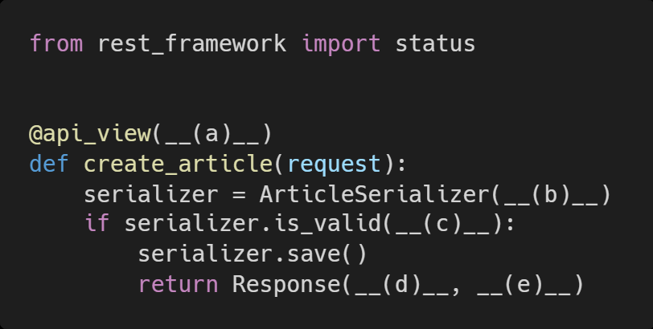

### Django_hw17

> Django REST Framework

### 1. T/F

- JSON 포맷의 데이터로 응답하기 위해서는 반드시 DRF 를 사용해야 한다 **F**
- DRF 가 제공하는 기본 Form 을 통해서만 여러 HTTP Method 를 테스트 해볼 수 있다**F**
- api_view 데코데이터를 사용하지 않아도 HTTP Method 에 대한 요청에 응답할 수 있다. **T**
- Serializers 는 Queryset 객체를 JSON 포맷으로 변환 할 수 있는 python 데이터 타입으로 만
  들어준다 **T**

### 2. REST API 디자인 가이드

EST API 디자인 설계 시 가장 중요한 항목을 2 가지로 요약한다면, 정보의 자원을 표현해야 하는 (A) 와
자원의 대한 행위를 표현하는 (B) 라고 할 수 있다.

**(A)** : URI - 인터넷의 리소스를 나타내는 유일한 주소 / 통합 자원 식별자

**(B)** : HTTP Method : 리소스에 대하 행위 / HTTP 는 HTTP Method를 정의하여 주어진 리소스에 수행하길 

​		원하는 행동을 나타냄

### 3. a, b, c, d, e 에 들어갈 코드를 작성하시오.

**(a)** ['POST']

**(b)** data=request.data

**(c)** raise_exception=True

**(d)** serializer.data

**(e)** status = status.HTTP_201_CREATED