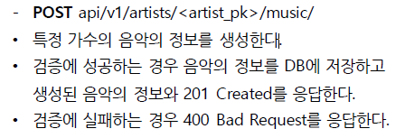

# Django_ws17

> DRF(Django REST Framework) 에 대한 이해


### 1. Model & Admin

- Artist  - name : 가수의 이름 
- Music -  Artist 와 1:N 관계 / title : 노래의 제목

```python
### musics/models.py

from django.db import models

class Artist(models.Model):
    name = models.CharField(max_length=10)

class Music(models.Model):
    artist = models.ForeignKey(Artist, on_delete=models.CASCADE)
    title = models.CharField(max_length=50)
```


### 2. Serializer


```python
### musics/serializers.py

from rest_framework import serializers
from .models import Artist, Music

class ArtistListSerializer(serializers.ModelSerializer):
    class Meta:
        model = Artist
        fields = ('id', 'name',)

class MusicSerializer(serializers.ModelSerializer):
    class Meta:
        model = Music
        fields = '__all__'
        # is valid 통과
        read_only_fields = ('artist',)

class ArtistSerializer(serializers.ModelSerializer):
    # 1. Artist의 music이 pk 형태로 표현됨.
    # music_set = serializers.PrimaryKeyRelatedField(many=True, read_only=True)
    # 2.  Artist의 music들의 정보가 모두(시리얼라이저에서 설정된 fields값) 표현됨.
    music_set = MusicSerializer(many=True, read_only=True)

    # music_set을 count한 결과
    music_count = serializers.IntegerField(source='music_set.count', read_only=True)
    class Meta:
        model = Artist
        fields = '__all__'

class MusicListSerializer(serializers.ModelSerializer):
    class Meta:
        model = Music
        fields = ('id', 'title', )
```


### 3. url & view

```python
### musics/views.py --head
from django.shortcuts import get_list_or_404, get_object_or_404

from .models import Artist, Music
from .serializers import ArtistListSerializer, ArtistSerializer, MusicListSerializer, MusicSerializer

from rest_framework.decorators import api_view
from rest_framework.response import Response
from rest_framework import status
```

**3-1**


```python
### musics/urls.py -- urlpattens
path('artists/', views.artist_list_create),

### musics/views.py

@api_view(['GET', 'POST'])
def artist_list_create(request):
    # GET : 모든 가수의 id와 name컬럼을 JSON 으로 응답    
    if request.method =='GET':
        artists = get_list_or_404(Artist)
        serializer = ArtistListSerializer(artists, many=True)
        return Response(serializer.data)
    
    # POST : 가수 생성 / 검증 성공 -> DB저장, 201 created / fail-400
    elif request.method =='POST':
        serializer = ArtistSerializer(data=request.data)
        if serializer.is_valid(raise_exception=True):
            serializer.save()
             return Response(serializer.data, status=status.HTTP_201_CREATED)
        return Response(serializer.errors, status=status.HTTP_400_BAD_REQUEST)

```


**3-2**


```python
### musics/urls.py -- urlpattens
    path('artists/<int:artist_pk>', views.artist_detail),

### musics/views.py
# GET : 특정 가수의 모든 컬럼을 JSON으로 / music 정보와 music 개수 함께 응답
@api_view(['GET'])
def artist_detail(request, artist_pk):
    if request.method =='GET':
        artist = get_object_or_404(Artist, pk = artist_pk)
        serializer = ArtistSerializer(artist)
        return Response(serializer.data)
```


**3-3**



```python
### musics/urls.py -- urlpattens
    path('artists/<int:artist_pk>/music/', views.music_create),
    
### musics/views.py
# POST : 특정 가수의 음악정보생성 / 검증 성공 -> DB저장, 201 created / fail-400
@api_view(['POST'])
def music_create(request, artist_pk):
        if request.method == 'POST':
            artist = get_object_or_404(Artist, pk=artist_pk)
            serializer = MusicSerializer(data=request.data)
            if serializer.is_valid(raise_exception=True):
            serializer.save(artist=artist)
            return Response(serializer.data, status=status.HTTP_201_CREATED)
        return Response(serializer.errors, status=status.HTTP_400_BAD_REQUEST)

```


**3-4**


```python
### musics/urls.py -- urlpattens
    path('musics/', views.music_list),
    
### musics/views.py
# GET : 모든 음악의 id와 title 컬럼을 JSON으로 응답
@api_view(['GET'])
def music_list(request):
    if request.method == 'GET':
        music = get_list_or_404(Music)
        serializer = MusicListSerializer(music, many=True)
        return Response(serializer.data)
```


**3-5**


```python
### musics/urls.py -- urlpattens
path('music/<int:music_pk>/', views.music_detail_delete_update),

### musics/views.py
# GET : 특정 음악의 모든 컬럼을 JSON으로 응답
# PUT : 특정 음악의 정보를 수정 / 검증 성공 - DB저장 / 실패 400 / 수정완료-수정정보 응답
# DELETE : 특정 음악의 정보를 삭제 / 삭제 완료 후 음악의 id와 204 No content 응답.
@api_view(['GET', 'DELETE', 'PUT' ,])
def music_detail_delete_update(request, music_pk):
    music = get_object_or_404(Music, pk=music_pk)

    # GET 
    if request.method == 'GET':
        serializer = MusicSerializer(music)
        return Response(serializer.data)

    # DELETE
    elif request.method == 'DELETE':
        music.delete()
        data = {
            'message': f'{music_pk}번 음악이 삭제되었습니다.'
        }
        return Response(data, status.HTTP_204_NO_CONTENT)
        
    # PUT
    elif request.method == 'PUT':
        serializer = MusicSerializer(music, data=request.data)
        if serializer.is_valid(raise_exception=True):
            serializer.save()
            return Response(data=serializer.data)
        return Response(serializer.errors, status=status.HTTP_400_BAD_REQUEST)
```

