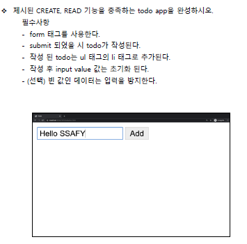

# Workshop18

> DOM 조작에 대한 이해



```html
<html lang="en">
<head>
  <meta charset="UTF-8">
  <meta http-equiv="X-UA-Compatible" content="IE=edge">
  <meta name="viewport" content="width=device-width, initial-scale=1.0">
  <title>Document</title>
</head>
<body>
  <form action="#">
    <input type="text" id="todo-input">
    <button> Add </button>
  </form>
  <ul id = 'todo-list'></ul>
  </ul>

  <script>
    const form = document.querySelector('form')
    // 
    form.addEventListener('submit', function (event) {
      // event.target : 이벤트가 발생한 요소
      // console.log(event.target)

      // 1. input 태그 선택하기(id로)
      const input = document.querySelector('#todo-input')
      // console.log(input.value)

      const content = input.value
      console.log('')
      if (content.trim() !== '') {
        // 3. li 태그 생성 &  ul 태그 선택 후 li넣기
        const li = document.createElement('li')
        li.innerText = content

        const ul = document.querySelector('#todo-list')
        ul.appendChild(li)
    } else {
        alert('입력 해주세요')
    }
      event.target.reset()
  })

  </script>
</body>
</html>
```

