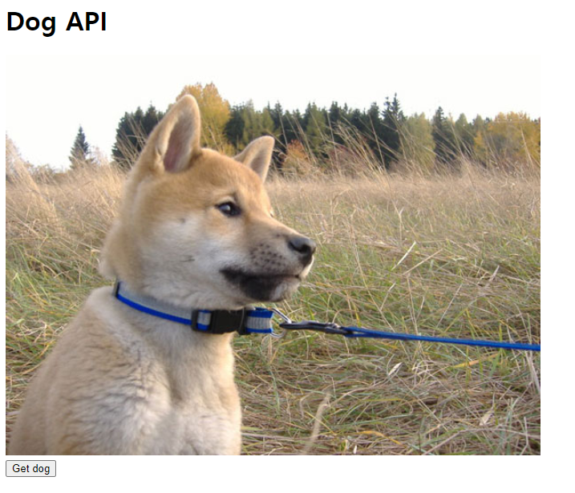

# JavaScripts WS03

> AJAX 요청에 대한 이해


### 공유된 HTML코드의 주석과 마크업을 참고하여, 버튼을 클릭하면 axios를 통해 API 요 청을 보내고 받아 온 이미지 데이터를 페이지에 렌더링 하는 앱을 완성하시오.
• API : https://dog.ceo/

```javascript
<!-- axios CDN을 삽입한다. -->
  <script src="https://cdn.jsdelivr.net/npm/axios/dist/axios.min.js"></script>

  <script>
    const API_URI = 'https://dog.ceo/api/breeds/image/random'
    
    function getDog () {
      // axios를 사용하여 API_URI로 GET 요청을 보낸다.
      const myPromise = axios.get(API_URI) 

      // .then 메서드를 통해 요청이 성공적인 경우의 콜백함수를 정의한다.
      myPromise
        .then((response) => {
          console.log(response)
          return response.data
        })
        .then((response) => {
        console.log(response)
        return response.message
        }) 
  
      // 응답객체의 데이터에서 이미지에 대한 리소스를 img 요소의 src 속성으로 할당한다.
      .then((response) => {
        const myImg = document.querySelector('img')
        myImg.src = response
        })      
    }

    const button = document.querySelector('button')
    button.addEventListener('click', getDog)
  </script>
```

