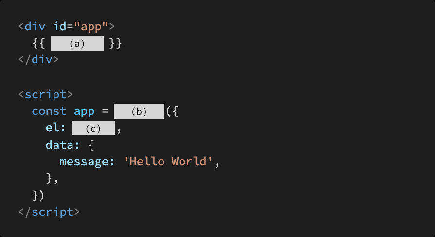
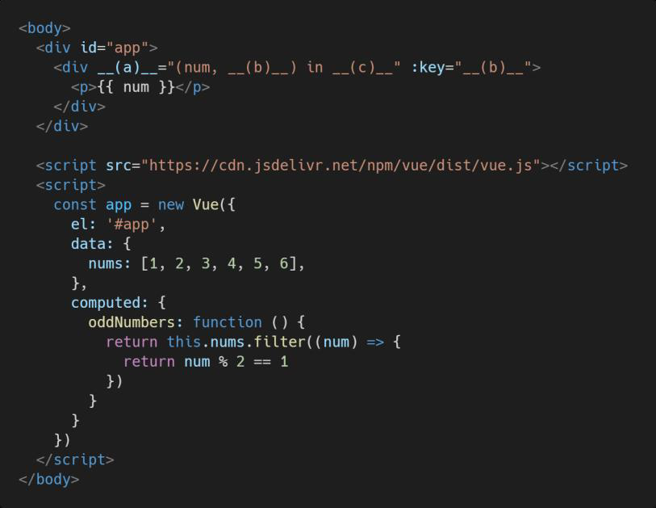

# Vue_Homework01

> Vue 기초 문법 및 개념

### 1. T/F

- SPA는 Single Pattern Application 의 약자이다 . **F**(Sigle Page Application)
- SPA는 웹 애플리케이션에 필요한 모든 정적 리소스를 한 번에 받고 , 이후부터는 페이 지 갱신에 필요한 데이터만 전달받는다 **T**
- Vue.js에서 말하는 ‘반응형’은 데이터가 변경되면 이에 반응하여 ,연결된 DOM 이 업데이트되는 것을 의미함. **T**

### 2. MVVM은 무엇의 약자이고 , 해당 패턴에서 각 파트의 역할은 무엇인지 간단히 서술.

1. Model : vue에서 사용되는 데이터와 그 데이터를 처리하는 부분이다
2. View : 사용자에게 모델을 실제로 보여주는 부분
3. View Model : View에서 표현하기 위해 만든 View를 위한 Model. view와 모델을 연결한다.

### 3.빈칸 (a), b), (c)에 들어갈 코드를 작성하시오 .

**(a)** : message

**(b)** :Vue

**(c)** : '#app'

### 4. T/F

- 동일한 요소에 v-for 와 v-if 두 디렉티브가 함께 작성된 경우 , 매 반복 시에 v-if 의 조건문으로 요소의 렌더링 여부를 결정한다 . **T**
- v-bind 디렉티브는 “@“, “, v-on 디렉티브는 “:” shortcut( 약어 )을 제공한다 .**T**
- v-model 디렉티브는 input, textarea, select ,같은 HTML 요소와 단방향 데이터 바인딩을 이루기 때문에 v-model 속성값의 제어를 통해 값을 바꿀 수 있다 . **F** (양방향 데이터바인딩)

### 5. computed와 watch 의 개념과 그 차이에 대해서 간단히 서술하시오 .

- `computed`: 캐시로 기록이 남아서, 불필요한 계산과 반복이 줄어들어 `watch` 보다 유용할 수 있다.

  하지만. 데이터변경 작업 등에서 수행빈도를 제한하거나 중간 상태을 설정해야 하는 경우는 `watch`가 더 유용할 수도 있다.

  

### 6. 다음은 홀수 데이터만 렌더링하는 Vue Application의 예시이다 .빈칸 (a), (b), (c)에 들어갈 코드를 작성하시오 .

**(a)** : `v-for` 

**(b)** : `idx`

**(c)** : `oddNumbers`