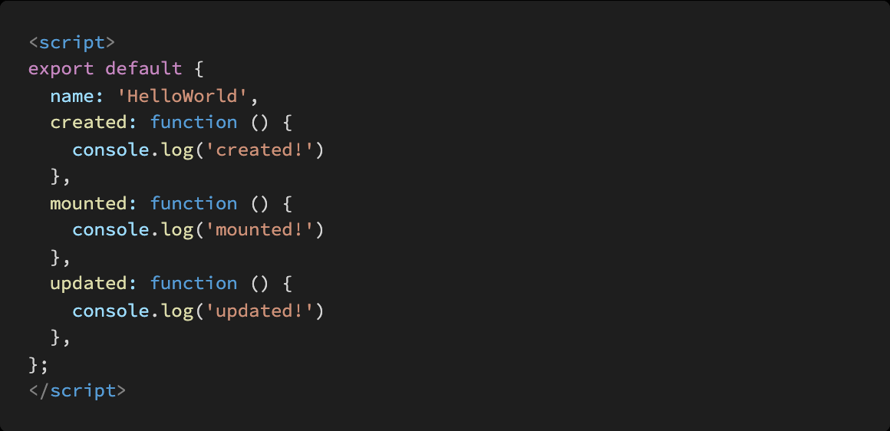

# VUE_homework02

> Vue

### 1. T/F

- Vue 의 Life Cycle Hook 에서 created Hook 은 Vue template 에 작성한 요소들이 DOM 에 다
  그려지는 시점에 실행된다 **F** (그려지는건 mounted / mount를 준비하는 과정임)
- npm 은 Node Package Manager 의 약자이며 npm 을 통해 설치한 package 목록은 package.json 파일에 자동으로 작성된다. **T**
- Vue CLI 를 통해 만든 프로젝트는 브라우저가 아닌 node.js 환경이기 때문에 DOM 조작이나
  Web API 호출 등 Vanilla JS 에서의 기능을 사용할 수 없다. **F**

### 2. Vue Router 에서 설정하는 history mode 가 무엇을 뜻하는지 서술하시오.

페이지를 다시 로드하지 않고 URL을 탐색할 수 있다. SPA의 단일 페이지 클라이언트앱이기 때문에 사용자가 직접 **http://example.ocm/user/id**에 접속하면 404 오류가 발생한다.

### 3.  console 창에 출력되는 메시지를 작성

mounted / updated

 