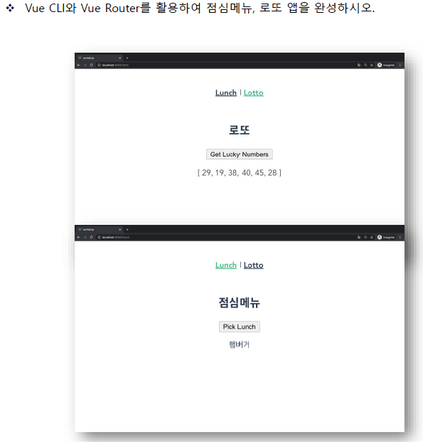

# vue02_workshop

> Vue CLI 및 Vue Router 에 대한 이해




**App.vue**

```vue
<template>
  <div id="app">
    <div id="nav">
      <router-link :to="{ name: 'TheLunch' }">Lunch</router-link> |
      <router-link :to="{ name: 'TheLotto' }">Lotto</router-link> 
    </div>
    <router-view/>
  </div>
</template>
```

**router/index.js**

```javascript
import Vue from 'vue'
import VueRouter from 'vue-router'
import TheLunch from '@/views/TheLunch.vue'
import TheLotto from '@/views/TheLotto.vue'

Vue.use(VueRouter)
const routes = [  {
    path: '/lunch',
    name: 'TheLunch',
    component: TheLunch  },  {
    path: '/lotto/:lottoNum',
    name: 'TheLotto',
    component: TheLotto  },]

const router = new VueRouter({
  mode: 'history',
  base: process.env.BASE_URL,
  routes})

export default router
```

**views/TheLunch.vue**

```vue
<template>
  <div>
    <h2>점심메뉴</h2>
    <button @click="pickOneLunchMenu">Pick Lunch</button>
    <p> {{ selectedLunchMenu }}</p>
  </div>
</template>

<script>
import _ from 'lodash'
export default {
    name: 'TheLunch' ,
    data: function () {
      return {
          lunch: ['김치찌개', '돈까스', '국밥'],
          selectedLunchMenu: '',
      }    },
    methods: {
        pickOneLunchMenu: function () {
            this.selectedLunchMenu = _.sample(this.lunch)
        }    }}
</script>
```

**views/TheLotto.vue**

```vue
<template>
  <div>
      <h2>로또</h2>
      <button @click="getLottoNums">Get Lucky Numbers</button>
      <!-- <p> {{ $route.params }}</p> -->
      <p> {{ selectedLottoNums }}</p>
  </div>
</template>

<script>
import _ from 'lodash'
export default {
    name: 'TheLotto',
    data: function () {
        return {
            sampleNums: [],
            selectedLottoNums: [],
        }    },
    methods: {
        getLottoNums: function (){
            const numbers = _.range(1, 46)
            this.sampleNums = _.sampleSize(numbers, 6)
            // this.sampleNums = _.sampleSize(numbers, this.$params.lottoNum)
            this.selectedLottoNums = _.sortBy(this.sampleNums)
        }    }}
</script>
```


