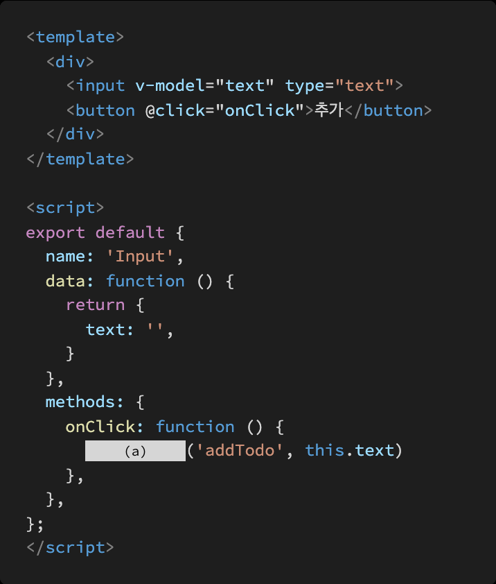
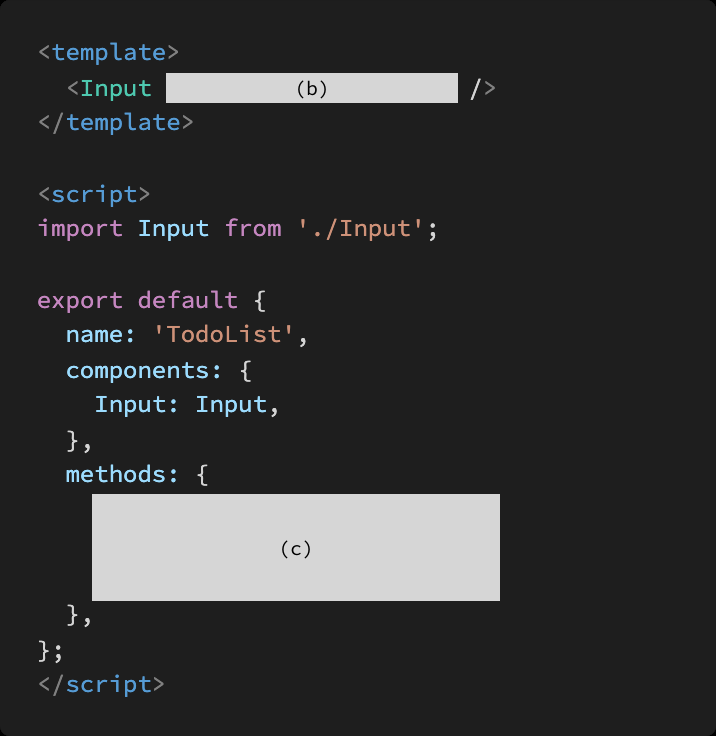

# Vue_Homework03

### 1. T/F

- Vue 는 컴포넌트 간 양방향 데이터 흐름을 지향하기 때문에 부모 , 자식 컴포넌트 간의 데이터 전달 및 수정이 자유롭다 **F** (단 방향)
- v-on 디렉티브는 해당 요소 또는 컴포넌트에서 특정 이벤트 발생 시 전달받은 함수를 실행한다 **T**
- 컴포넌트에서 클릭 이벤트 발생 시 특정 함수를 실행하고자 할 때 , @click 혹은 v on: click 디렉티브를 사용한다. **T**
- 부모 컴포넌트는 props 를 통해 자식 컴포넌트에게 이벤트를 보내고 자식 컴포넌트는 emit 을 통해 부모 컴포넌트에게 데이터를 전달한다 **F**(이벤트와 데이터 바뀜)

### 2. Vue 는 단방향 데이터 흐름을 지향하는 프론트엔드 프레임워크다 공식문서를 참고하여 그 이유를 서술하시오 . 

데이터의 흐름이 단순한 애플리케이션에서는 데이터의 흐름을 쉽게 파악할 수 있다.

### 3. 다음은 자식 컴포넌트에서 이벤트를 발생시켜 부모 컴퍼넌트의 함수를 실행하는 코드

- Input 컴포넌트의 버튼을 누르면 addTodo 이벤트가 발생한다 . 이벤트 발생 시 data 의 text 값도 함께 전달.
- TodoList 컴포넌트에서 addTodo 이벤트가 발생하면 , onAddTodo 함수를 실행한다.
- onAddTodo 함수에서는 자식 컴포넌트에서 전달받은 값을 console.log 함수를 통해 출력한다

**Input.vue**

**TodoList.vue**

**(a)** : this.$emit

**(b)** : @addTodo="onClick"

**(c)** : onClick(value) { 

​		console.log( this.text)}