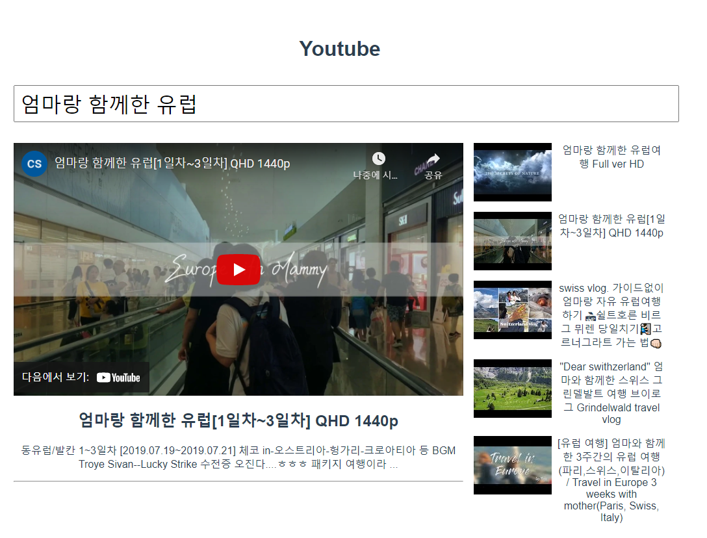

# Youtube



**App.vue**

```vue
<template>
  <div id="app">
    <h1>Youtube</h1>
    <header>
      <SearchBar @input-search="onInputSearch"/>
    </header>
    <section>
      <VideoDetail :video="selectVideo"/>
      <VideoList 
        :videos="videos"
        @select-video="onVideoSelect"
      />
    </section>
  </div>
</template>

<script>
import axios from 'axios'
import SearchBar from '@/components/SearchBar.vue'
import VideoList from '@/components/VideoList.vue'
import VideoDetail from '@/components/VideoDetail.vue'


const API_KEY = ''
const API_URL = 'https://www.googleapis.com/youtube/v3/search'


export default {
  name: 'App',
  components: {
    SearchBar,
    VideoList,
    VideoDetail,
  },
  data: function () {
    return {
      searchData: '',
      videos: [],
      selectVideo: '',
    }
  },
  methods: {
    onVideoSelect: function (video) {
      this.selectVideo = video
    },
    onInputSearch: function (searchData) {

      this.searchData = searchData
      const params = {
        key: API_KEY,
        part: 'snippet',
        type: 'video',
        q: this.searchData,
      }
      axios({
        url: API_URL,
        method: 'get',
        params,
      })
        .then(res => {
          console.log(res.data.items)
          this.videos = res.data.items
          this.selectVideo = this.videos[0]
        })
        .catch(err => {
          console.log(err)
        })
    }  }}
</script>


```


**searchbar.vue**

```vue
template>
  <div class="search-bar">
    <input type="text" @keyup.enter="onInputKeyword">
  </div>
</template>
<script>
export default {
  name: 'SearchBar',
  methods: {
    onInputKeyword: function (event) {
      this.$emit('input-search', event.target.value)
    }  }}
</script>
```


**VideoList**

```vue
<template>
  <ul class="video-list list-group">
    <VideoListItem 
      v-for="(video, idx) in videos" 
      :key="idx"
      :video="video"
      @select-video="onSelectVideo"
    />
  </ul>
</template>

<script>
import VideoListItem from '@/components/VideoListItem.vue'

export default {
  name: 'VideoList',
  components: {
    VideoListItem,
  },
  props: {
    videos: {
      type: Array,
    }  },
  methods: {
    onSelectVideo: function (video) {
      this.$emit('select-video', video)
    }  }}
</script>
```


**VideoListItem**

```vue
<template>
  <li @click="selectVideo" class="list-group-item">
    
    <!-- <span v-html="video.snippet.title"></span> -->
    {{ video.snippet.title | stringUnescape }}
  </li>
</template>

<script>
import _ from 'lodash'

export default {
  name: 'VideoListItem',
  props: {
    video: {
      type: Object,
    }
  },
  methods: {
    selectVideo: function () {
      this.$emit('select-video', this.video)
    }  },
    
  computed: {
    youtubeImgSrc: function () {
      return this.video.snippet.thumbnails.default.url
    }
  },
  filters: {
    stringUnescape: function (rawText) {
      return _.unescape(rawText)
    }  },}
</script>
```


**VideoDetail.vue**

```vue
<template>
  <div class="video-detail" v-if="video">
    <div class="video-container">
      <iframe :src="videoUrl" frameborder="0"></iframe>
    </div>
    <h2>{{ video.snippet.title | stringUnescape }}</h2>
    <p>{{ video.snippet.description | stringUnescape}}</p>
    <hr>
  </div>
</template>

<script>
import _ from 'lodash'

export default {
  name: 'VideoDetail',
  props: {
    video: {
      type: [String, Object],
    }  },
  computed: {
    videoUrl: function () {
      const videoId = this.video.id.videoId
      return `https://www.youtube.com/embed/${videoId}`
    }
  },
  filters: {
    stringUnescape: function (rawText) {
      return _.unescape(rawText)
    }  },}
</script>
```


