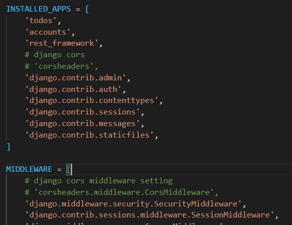
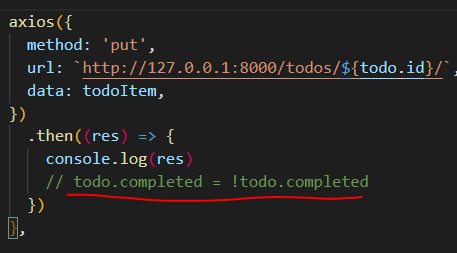

# Vue with Server

> Django 와 Vue 를 활용한 Client/Server 에 대한 이해

### 1. 사전 제공된 django 와 vue 프로젝트를 통해 Todo 를 가져오는 과정에서 발생하는 CORS 관련 이슈를 해결하고 Todo 의 작성 수정 취소선 토글 삭제를 구현하시오.

**답)**  (1) server/mypjt/settings.py

(2) client/src/views/todos/TodoList.vue

